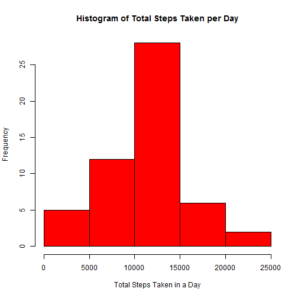
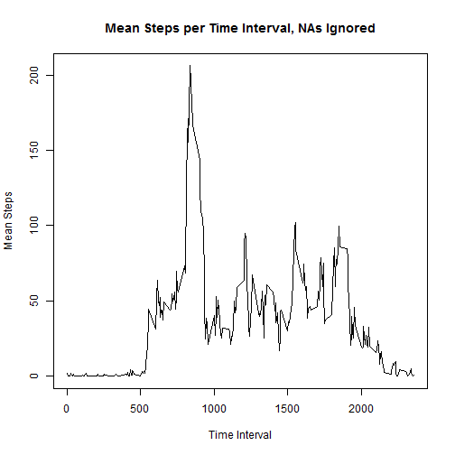
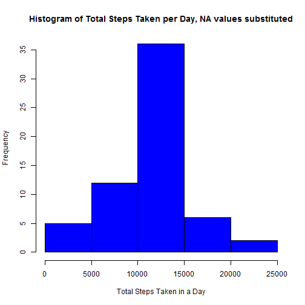
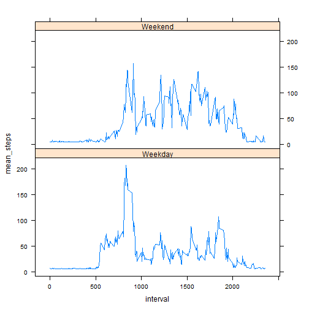

Loading and preprocessing the data
=======================================

Data is downloaded from 
 https://d396qusza40orc.cloudfront.net/repdata%2Fdata%2Factivity.zip
 9 January 2016


```r
activity <- read.csv("C:/Users/mbonifac/Desktop/Coursera/R_Portfolio/activity.csv")
```

What is the mean total number of steps taken per day?
=======================================

Create a data set summing steps recorded each day, ignore NA cases


```r
activity2 <- activity[complete.cases(activity),]
dayactivity <- aggregate(activity2$steps, by=list(activity2$date), FUN = "sum")
colnames(dayactivity) <- c("date", "steps")
```

Plot histogram of total steps taken in a day


```r
hist(dayactivity$steps, col = "red", main = paste("Histogram of", "Total Steps Taken per Day"), xlab = "Total Steps Taken in a Day")
```



Create a data frame listing the number of steps recorded each day


```r
meanactivity <- aggregate(activity2$steps, by=list(activity2$date), FUN = "mean")
colnames(meanactivity) <- c("date", "mean_steps")
meanactivity
```

```
##          date mean_steps
## 1  2012-10-02  0.4375000
## 2  2012-10-03 39.4166667
## 3  2012-10-04 42.0694444
## 4  2012-10-05 46.1597222
## 5  2012-10-06 53.5416667
## 6  2012-10-07 38.2465278
## 7  2012-10-09 44.4826389
## 8  2012-10-10 34.3750000
## 9  2012-10-11 35.7777778
## 10 2012-10-12 60.3541667
## 11 2012-10-13 43.1458333
## 12 2012-10-14 52.4236111
## 13 2012-10-15 35.2048611
## 14 2012-10-16 52.3750000
## 15 2012-10-17 46.7083333
## 16 2012-10-18 34.9166667
## 17 2012-10-19 41.0729167
## 18 2012-10-20 36.0937500
## 19 2012-10-21 30.6284722
## 20 2012-10-22 46.7361111
## 21 2012-10-23 30.9652778
## 22 2012-10-24 29.0104167
## 23 2012-10-25  8.6527778
## 24 2012-10-26 23.5347222
## 25 2012-10-27 35.1354167
## 26 2012-10-28 39.7847222
## 27 2012-10-29 17.4236111
## 28 2012-10-30 34.0937500
## 29 2012-10-31 53.5208333
## 30 2012-11-02 36.8055556
## 31 2012-11-03 36.7048611
## 32 2012-11-05 36.2465278
## 33 2012-11-06 28.9375000
## 34 2012-11-07 44.7326389
## 35 2012-11-08 11.1770833
## 36 2012-11-11 43.7777778
## 37 2012-11-12 37.3784722
## 38 2012-11-13 25.4722222
## 39 2012-11-15  0.1423611
## 40 2012-11-16 18.8923611
## 41 2012-11-17 49.7881944
## 42 2012-11-18 52.4652778
## 43 2012-11-19 30.6979167
## 44 2012-11-20 15.5277778
## 45 2012-11-21 44.3993056
## 46 2012-11-22 70.9270833
## 47 2012-11-23 73.5902778
## 48 2012-11-24 50.2708333
## 49 2012-11-25 41.0902778
## 50 2012-11-26 38.7569444
## 51 2012-11-27 47.3819444
## 52 2012-11-28 35.3576389
## 53 2012-11-29 24.4687500
```

Create a data frame listing the median number of steps recorded each day


```r
medactivity <- aggregate(activity2$steps, by=list(activity2$date), FUN = "median")
colnames(medactivity) <- c("date", "median_steps")
medactivity
```

```
##          date median_steps
## 1  2012-10-02            0
## 2  2012-10-03            0
## 3  2012-10-04            0
## 4  2012-10-05            0
## 5  2012-10-06            0
## 6  2012-10-07            0
## 7  2012-10-09            0
## 8  2012-10-10            0
## 9  2012-10-11            0
## 10 2012-10-12            0
## 11 2012-10-13            0
## 12 2012-10-14            0
## 13 2012-10-15            0
## 14 2012-10-16            0
## 15 2012-10-17            0
## 16 2012-10-18            0
## 17 2012-10-19            0
## 18 2012-10-20            0
## 19 2012-10-21            0
## 20 2012-10-22            0
## 21 2012-10-23            0
## 22 2012-10-24            0
## 23 2012-10-25            0
## 24 2012-10-26            0
## 25 2012-10-27            0
## 26 2012-10-28            0
## 27 2012-10-29            0
## 28 2012-10-30            0
## 29 2012-10-31            0
## 30 2012-11-02            0
## 31 2012-11-03            0
## 32 2012-11-05            0
## 33 2012-11-06            0
## 34 2012-11-07            0
## 35 2012-11-08            0
## 36 2012-11-11            0
## 37 2012-11-12            0
## 38 2012-11-13            0
## 39 2012-11-15            0
## 40 2012-11-16            0
## 41 2012-11-17            0
## 42 2012-11-18            0
## 43 2012-11-19            0
## 44 2012-11-20            0
## 45 2012-11-21            0
## 46 2012-11-22            0
## 47 2012-11-23            0
## 48 2012-11-24            0
## 49 2012-11-25            0
## 50 2012-11-26            0
## 51 2012-11-27            0
## 52 2012-11-28            0
## 53 2012-11-29            0
```

What is the average daily activity pattern?
=======================================

Create a data frame listing average number of steps recorded at each interval, ignoring NA


```r
intactivity <- aggregate(activity2$steps, by=list(activity2$interval), FUN = "mean")
colnames(intactivity) <- c("interval", "mean_steps")
```

Plot the mean_steps vs interval


```r
plot(intactivity$interval, intactivity$mean_steps, type = "l", main = paste("Mean Steps per Time Interval, NAs Ignored"), ylab = "Mean Steps", xlab = "Time Interval")
```



The maximum mean is 206 steps at the 835 interval

Imputing missing values
=======================================

First determine the number of missing values in activity data frame


```r
NA_count <- nrow(activity) - nrow(activity2)
NA_count
```

```
## [1] 2304
```

The NA values are replaced with average daily value
A histogram is made of the total steps taken each day


```r
activity3 <- activity
activity3$steps[which(is.na(activity3$steps))]<-mean(meanactivity$mean_steps)
## Create a data set summing steps per day with the substituted NA values used
dayactivity_sub <- aggregate(activity3$steps, by=list(activity3$date), FUN = "sum")
colnames(dayactivity_sub) <- c("date", "steps")
## Plot histogram of total steps taken in a day using the substituted values
hist(dayactivity_sub$steps, col = "blue", main = paste("Histogram of Total Steps Taken per Day, NA values substituted"), xlab = "Total Steps Taken in a Day")
```



Compare median and mean of the data set with NAs removed (dayactivity)
to that of the dat set with replaced NAs (dayactivity_sub)


```r
dayactivity_mean<-mean(dayactivity$steps)
dayactivity_mean
```

```
## [1] 10766.19
```


```r
dayactivity_median<-median(dayactivity$steps)
dayactivity_median
```

```
## [1] 10765
```


```r
dayactivity_sub_mean<-mean(dayactivity_sub$steps)
dayactivity_sub_mean
```

```
## [1] 10766.19
```


```r
dayactivity_sub_median<-median(dayactivity_sub$steps)
dayactivity_sub_median
```

```
## [1] 10766.19
```

There is little variation between the mean and median values for both data sets

Are there differences in activity patterns between weekdays and weekends?
=======================================

Data set with the filled-in NA values (activity3) is used
The Date column is changed from factor to date
Day of the week is also added to data frame
Weekday/Weekend designation is added


```r
activity3$date<-as.Date(activity3$date)
## Add column identifying day of the week
day<-weekdays(activity3$date)
activity4<-cbind(activity3,day)
## Create factors identifying weekdays and weekends
day <-c("Monday", "Tuesday", "Wednesday", "Thursday", "Friday", "Saturday", "Sunday")
wkday <- c("Weekday", "Weekday", "Weekday", "Weekday", "Weekday", "Weekend", "Weekend")
daycat<-cbind(day,wkday)
## Merge activity4 with daycat to apply weekday/weekend factors
activity4<-merge(activity4,daycat)
activity4
```

```
##             day    steps       date interval   wkday
## 1        Friday   0.0000 2012-10-05     2220 Weekday
## 2        Friday   0.0000 2012-11-16      430 Weekday
## 3        Friday   0.0000 2012-10-05     2235 Weekday
## 4        Friday   0.0000 2012-11-16      435 Weekday
## 5        Friday   0.0000 2012-10-05     2315 Weekday
## 6        Friday   0.0000 2012-11-16      445 Weekday
## 7        Friday   0.0000 2012-10-05     2255 Weekday
## 8        Friday   0.0000 2012-10-05     2300 Weekday
## 9        Friday   0.0000 2012-10-05     2305 Weekday
## 10       Friday   0.0000 2012-10-12     2245 Weekday
## 11       Friday  37.3826 2012-11-09      635 Weekday
## 12       Friday  37.3826 2012-11-09      640 Weekday
## 13       Friday  37.3826 2012-11-09      645 Weekday
## 14       Friday   0.0000 2012-10-05     2225 Weekday
## 15       Friday   0.0000 2012-10-05     2230 Weekday
## 16       Friday  37.3826 2012-11-09      700 Weekday
## 17       Friday   0.0000 2012-10-05     2240 Weekday
## 18       Friday   0.0000 2012-11-16      440 Weekday
## 19       Friday   0.0000 2012-10-05     2250 Weekday
## 20       Friday  37.3826 2012-11-09      720 Weekday
## 21       Friday   0.0000 2012-11-16      450 Weekday
## 22       Friday   0.0000 2012-11-16      455 Weekday
## 23       Friday   0.0000 2012-10-05     2310 Weekday
## 24       Friday   0.0000 2012-11-16      505 Weekday
## 25       Friday   0.0000 2012-11-16      510 Weekday
## 26       Friday   0.0000 2012-11-16      515 Weekday
## 27       Friday  37.3826 2012-11-09      650 Weekday
## 28       Friday  37.3826 2012-11-09      655 Weekday
## 29       Friday   0.0000 2012-11-16      525 Weekday
## 30       Friday  37.3826 2012-11-09      705 Weekday
## 31       Friday  37.3826 2012-11-09      710 Weekday
## 32       Friday  37.3826 2012-11-09      715 Weekday
## 33       Friday   0.0000 2012-10-12     2225 Weekday
## 34       Friday   8.0000 2012-10-12     2230 Weekday
## 35       Friday   0.0000 2012-10-12     2235 Weekday
## 36       Friday   0.0000 2012-10-12     2240 Weekday
## 37       Friday   0.0000 2012-10-05     2200 Weekday
## 38       Friday   0.0000 2012-10-12     2250 Weekday
## 39       Friday   0.0000 2012-10-12     2255 Weekday
## 40       Friday   0.0000 2012-10-12     2300 Weekday
## 41       Friday   0.0000 2012-10-12     2305 Weekday
## 42       Friday   0.0000 2012-10-12     2310 Weekday
## 43       Friday   0.0000 2012-10-12     2315 Weekday
## 44       Friday   0.0000 2012-10-12     2320 Weekday
## 45       Friday   0.0000 2012-10-05     2245 Weekday
## 46       Friday   0.0000 2012-11-16      645 Weekday
## 47       Friday   0.0000 2012-11-16      650 Weekday
## 48       Friday   0.0000 2012-11-16      655 Weekday
## 49       Friday   0.0000 2012-11-16      700 Weekday
## 50       Friday   0.0000 2012-11-16      705 Weekday
## 51       Friday   0.0000 2012-11-16      710 Weekday
## 52       Friday   0.0000 2012-11-16      715 Weekday
## 53       Friday   0.0000 2012-10-05     2320 Weekday
## 54       Friday   0.0000 2012-11-16      410 Weekday
## 55       Friday   0.0000 2012-11-16      415 Weekday
## 56       Friday   0.0000 2012-11-16      420 Weekday
## 57       Friday   0.0000 2012-11-16      425 Weekday
## 58       Friday   0.0000 2012-11-02      620 Weekday
## 59       Friday   0.0000 2012-11-02      625 Weekday
## 60       Friday   0.0000 2012-11-02      630 Weekday
## 61       Friday   0.0000 2012-11-02      635 Weekday
## 62       Friday   0.0000 2012-11-02      640 Weekday
## 63       Friday   0.0000 2012-11-16      500 Weekday
## 64       Friday   0.0000 2012-11-02      650 Weekday
## 65       Friday   0.0000 2012-11-02      655 Weekday
## 66       Friday   0.0000 2012-11-02      700 Weekday
## 67       Friday   0.0000 2012-11-02      705 Weekday
## 68       Friday   0.0000 2012-11-16      520 Weekday
## 69       Friday  37.3826 2012-11-09      440 Weekday
## 70       Friday  37.3826 2012-11-09      445 Weekday
## 71       Friday  37.3826 2012-11-09      450 Weekday
## 72       Friday  37.3826 2012-11-09      455 Weekday
## 73       Friday  37.3826 2012-11-09      500 Weekday
## 74       Friday  37.3826 2012-11-09      505 Weekday
## 75       Friday  37.3826 2012-11-09      510 Weekday
## 76       Friday  37.3826 2012-11-09      515 Weekday
## 77       Friday  37.3826 2012-11-09      520 Weekday
## 78       Friday   0.0000 2012-10-05     2205 Weekday
## 79       Friday   0.0000 2012-10-05     2210 Weekday
## 80       Friday   0.0000 2012-10-05     2215 Weekday
## 81       Friday   0.0000 2012-11-16      620 Weekday
## 82       Friday   0.0000 2012-11-16      625 Weekday
## 83       Friday   0.0000 2012-11-16      630 Weekday
## 84       Friday   0.0000 2012-11-16      635 Weekday
## 85       Friday   0.0000 2012-11-16      640 Weekday
## 86       Friday  37.3826 2012-11-09      605 Weekday
## 87       Friday  37.3826 2012-11-09      610 Weekday
## 88       Friday  37.3826 2012-11-09      615 Weekday
## 89       Friday  37.3826 2012-11-09      620 Weekday
## 90       Friday  37.3826 2012-11-09      625 Weekday
## 91       Friday  37.3826 2012-11-09      630 Weekday
## 92       Friday   0.0000 2012-10-12     2030 Weekday
## 93       Friday   0.0000 2012-10-12     2035 Weekday
## 94       Friday   0.0000 2012-10-12     2040 Weekday
## 95       Friday  18.0000 2012-10-12     2045 Weekday
## 96       Friday  30.0000 2012-10-12     2050 Weekday
## 97       Friday  23.0000 2012-10-12     2055 Weekday
## 98       Friday  70.0000 2012-10-12     2100 Weekday
## 99       Friday 113.0000 2012-10-12     2105 Weekday
## 100      Friday   0.0000 2012-10-12     2110 Weekday
## 101      Friday   0.0000 2012-10-12     2115 Weekday
## 102      Friday  37.3826 2012-11-09      725 Weekday
## 103      Friday   0.0000 2012-11-02      645 Weekday
## 104      Friday  37.3826 2012-11-09      415 Weekday
## 105      Friday  37.3826 2012-11-09      420 Weekday
## 106      Friday  37.3826 2012-11-09      425 Weekday
## 107      Friday  37.3826 2012-11-09      430 Weekday
## 108      Friday  37.3826 2012-11-09      435 Weekday
## 109      Friday   0.0000 2012-10-12     2200 Weekday
## 110      Friday   0.0000 2012-10-12     2205 Weekday
## 111      Friday   0.0000 2012-10-12     2210 Weekday
## 112      Friday   9.0000 2012-10-12     2215 Weekday
## 113      Friday   0.0000 2012-10-12     2220 Weekday
## 114      Friday   0.0000 2012-11-02      415 Weekday
## 115      Friday   0.0000 2012-11-02      420 Weekday
## 116      Friday   0.0000 2012-11-02      425 Weekday
## 117      Friday   0.0000 2012-11-02      430 Weekday
## 118      Friday   0.0000 2012-11-02      435 Weekday
## 119      Friday   0.0000 2012-11-02      440 Weekday
## 120      Friday   0.0000 2012-11-02      445 Weekday
## 121      Friday   0.0000 2012-11-02      450 Weekday
## 122      Friday   0.0000 2012-11-02      455 Weekday
## 123      Friday   0.0000 2012-11-02      500 Weekday
## 124      Friday   0.0000 2012-11-02      505 Weekday
## 125      Friday   0.0000 2012-11-02      510 Weekday
## 126      Friday   0.0000 2012-10-12     2325 Weekday
## 127      Friday   0.0000 2012-10-12     2330 Weekday
## 128      Friday   0.0000 2012-10-12     2335 Weekday
## 129      Friday   0.0000 2012-10-12     2340 Weekday
## 130      Friday   0.0000 2012-10-12     2345 Weekday
## 131      Friday   0.0000 2012-10-12     2350 Weekday
## 132      Friday   0.0000 2012-10-12     2355 Weekday
## 133      Friday   0.0000 2012-11-16      400 Weekday
## 134      Friday   0.0000 2012-11-16      405 Weekday
## 135      Friday   0.0000 2012-11-02      600 Weekday
## 136      Friday   0.0000 2012-11-02      605 Weekday
## 137      Friday   0.0000 2012-11-02      610 Weekday
## 138      Friday   0.0000 2012-11-02      615 Weekday
## 139      Friday   0.0000 2012-10-05     2020 Weekday
## 140      Friday   0.0000 2012-10-05     2025 Weekday
## 141      Friday   0.0000 2012-10-05     2030 Weekday
## 142      Friday  71.0000 2012-10-05     2035 Weekday
## 143      Friday   0.0000 2012-10-05     2040 Weekday
## 144      Friday   0.0000 2012-10-05     2045 Weekday
## 145      Friday   0.0000 2012-10-05     2050 Weekday
## 146      Friday   0.0000 2012-10-05     2055 Weekday
## 147      Friday   0.0000 2012-10-05     2100 Weekday
## 148      Friday   0.0000 2012-10-05     2105 Weekday
## 149      Friday   0.0000 2012-11-02      710 Weekday
## 150      Friday 117.0000 2012-11-02      715 Weekday
## 151      Friday   0.0000 2012-11-02      720 Weekday
## 152      Friday   0.0000 2012-11-16      530 Weekday
## 153      Friday   0.0000 2012-11-16      535 Weekday
## 154      Friday   0.0000 2012-11-16      540 Weekday
## 155      Friday   0.0000 2012-11-16      545 Weekday
## 156      Friday   0.0000 2012-11-16      550 Weekday
## 157      Friday   0.0000 2012-11-16      555 Weekday
## 158      Friday   0.0000 2012-11-16      600 Weekday
## 159      Friday   0.0000 2012-11-16      605 Weekday
## 160      Friday   0.0000 2012-11-16      610 Weekday
## 161      Friday   0.0000 2012-11-16      615 Weekday
## 162      Friday   0.0000 2012-10-26      405 Weekday
## 163      Friday   0.0000 2012-10-26      410 Weekday
## 164      Friday   0.0000 2012-10-26      415 Weekday
## 165      Friday   0.0000 2012-10-26      420 Weekday
## 166      Friday   0.0000 2012-10-26      425 Weekday
## 167      Friday   0.0000 2012-10-26      430 Weekday
## 168      Friday   6.0000 2012-10-26      435 Weekday
## 169      Friday  10.0000 2012-10-26      440 Weekday
## 170      Friday  20.0000 2012-10-26      445 Weekday
## 171      Friday  14.0000 2012-10-26      450 Weekday
## 172      Friday   0.0000 2012-10-26      455 Weekday
## 173      Friday   0.0000 2012-10-26      500 Weekday
## 174      Friday   0.0000 2012-11-16      720 Weekday
## 175      Friday   0.0000 2012-10-05     2325 Weekday
## 176      Friday   0.0000 2012-10-05     2330 Weekday
## 177      Friday   0.0000 2012-10-05     2335 Weekday
## 178      Friday   0.0000 2012-10-05     2340 Weekday
## 179      Friday   0.0000 2012-10-05     2345 Weekday
## 180      Friday   0.0000 2012-10-05     2350 Weekday
## 181      Friday   0.0000 2012-10-05     2355 Weekday
## 182      Friday  37.3826 2012-11-09      400 Weekday
## 183      Friday  37.3826 2012-11-09      405 Weekday
## 184      Friday  37.3826 2012-11-09      410 Weekday
## 185      Friday  55.0000 2012-10-26      600 Weekday
## 186      Friday  23.0000 2012-10-26      605 Weekday
## 187      Friday  69.0000 2012-10-26      610 Weekday
## 188      Friday  30.0000 2012-10-26      615 Weekday
## 189      Friday   0.0000 2012-10-26      620 Weekday
## 190      Friday   0.0000 2012-10-26      625 Weekday
## 191      Friday  10.0000 2012-10-26      630 Weekday
## 192      Friday   0.0000 2012-10-26      635 Weekday
## 193      Friday   0.0000 2012-10-26      640 Weekday
## 194      Friday  32.0000 2012-10-26      645 Weekday
## 195      Friday  14.0000 2012-10-26      650 Weekday
## 196      Friday  54.0000 2012-10-26      655 Weekday
## 197      Friday   0.0000 2012-10-26      700 Weekday
## 198      Friday  14.0000 2012-10-26      705 Weekday
## 199      Friday  37.3826 2012-11-09      525 Weekday
## 200      Friday  37.3826 2012-11-09      530 Weekday
## 201      Friday  37.3826 2012-11-09      535 Weekday
## 202      Friday  37.3826 2012-11-09      540 Weekday
## 203      Friday  37.3826 2012-11-09      545 Weekday
## 204      Friday  37.3826 2012-11-09      550 Weekday
## 205      Friday  37.3826 2012-11-09      555 Weekday
## 206      Friday  37.3826 2012-11-09      600 Weekday
## 207      Friday   0.0000 2012-10-12     2000 Weekday
## 208      Friday   0.0000 2012-10-12     2005 Weekday
## 209      Friday   0.0000 2012-10-12     2010 Weekday
## 210      Friday   0.0000 2012-10-12     2015 Weekday
## 211      Friday   0.0000 2012-10-12     2020 Weekday
## 212      Friday   0.0000 2012-10-12     2025 Weekday
## 213      Friday   8.0000 2012-10-26      820 Weekday
## 214      Friday  13.0000 2012-10-26      825 Weekday
## 215      Friday  15.0000 2012-10-26      830 Weekday
## 216      Friday  34.0000 2012-10-26      835 Weekday
## 217      Friday  16.0000 2012-10-26      840 Weekday
## 218      Friday 203.0000 2012-10-26      845 Weekday
## 219      Friday 440.0000 2012-10-26      850 Weekday
## 220      Friday  56.0000 2012-10-26      855 Weekday
## 221      Friday 164.0000 2012-10-26      900 Weekday
## 222      Friday 159.0000 2012-10-26      905 Weekday
## 223      Friday   0.0000 2012-10-12     2120 Weekday
## 224      Friday   0.0000 2012-10-12     2125 Weekday
## 225      Friday   0.0000 2012-10-12     2130 Weekday
## 226      Friday   0.0000 2012-10-12     2135 Weekday
## 227      Friday   0.0000 2012-10-12     2140 Weekday
## 228      Friday   0.0000 2012-10-12     2145 Weekday
## 229      Friday   0.0000 2012-10-12     2150 Weekday
## 230      Friday   0.0000 2012-10-12     2155 Weekday
## 231      Friday   0.0000 2012-11-02      355 Weekday
## 232      Friday   0.0000 2012-11-02      400 Weekday
## 233      Friday   0.0000 2012-11-02      405 Weekday
## 234      Friday   0.0000 2012-11-02      410 Weekday
## 235      Friday  37.3826 2012-11-09      820 Weekday
## 236      Friday  37.3826 2012-11-09      825 Weekday
## 237      Friday  37.3826 2012-11-09      830 Weekday
## 238      Friday  37.3826 2012-11-09      835 Weekday
## 239      Friday  37.3826 2012-11-09      840 Weekday
## 240      Friday  37.3826 2012-11-09      845 Weekday
## 241      Friday  37.3826 2012-11-09      850 Weekday
## 242      Friday  37.3826 2012-11-09      855 Weekday
## 243      Friday  37.3826 2012-11-09      900 Weekday
## 244      Friday  37.3826 2012-11-09      905 Weekday
## 245      Friday  37.3826 2012-11-09      910 Weekday
## 246      Friday  37.3826 2012-11-09      915 Weekday
## 247      Friday   0.0000 2012-11-02      515 Weekday
## 248      Friday   0.0000 2012-11-02      520 Weekday
## 249      Friday   0.0000 2012-11-02      525 Weekday
## 250      Friday   0.0000 2012-11-02      530 Weekday
## 251      Friday   0.0000 2012-11-02      535 Weekday
## 252      Friday   0.0000 2012-11-02      540 Weekday
## 253      Friday   0.0000 2012-11-02      545 Weekday
## 254      Friday   0.0000 2012-11-02      550 Weekday
## 255      Friday   0.0000 2012-11-02      555 Weekday
## 256      Friday   0.0000 2012-10-05     2000 Weekday
## 257      Friday   0.0000 2012-10-05     2005 Weekday
## 258      Friday   0.0000 2012-10-05     2010 Weekday
## 259      Friday   0.0000 2012-10-05     2015 Weekday
## 260      Friday   0.0000 2012-11-23      830 Weekday
## 261      Friday   0.0000 2012-11-23      835 Weekday
## 262      Friday   0.0000 2012-11-23      840 Weekday
## 263      Friday   0.0000 2012-11-23      845 Weekday
## 264      Friday   0.0000 2012-11-23      850 Weekday
## 265      Friday   0.0000 2012-11-23      855 Weekday
## 266      Friday   0.0000 2012-11-23      900 Weekday
## 267      Friday   0.0000 2012-11-23      905 Weekday
## 268      Friday   0.0000 2012-11-23      910 Weekday
## 269      Friday   0.0000 2012-11-23      915 Weekday
## 270      Friday   0.0000 2012-10-05     2110 Weekday
## 271      Friday   0.0000 2012-10-05     2115 Weekday
## 272      Friday   0.0000 2012-10-05     2120 Weekday
## 273      Friday   0.0000 2012-10-05     2125 Weekday
## 274      Friday   0.0000 2012-10-05     2130 Weekday
## 275      Friday   0.0000 2012-10-05     2135 Weekday
## 276      Friday   0.0000 2012-10-05     2140 Weekday
## 277      Friday   0.0000 2012-10-05     2145 Weekday
## 278      Friday   0.0000 2012-10-05     2150 Weekday
## 279      Friday   0.0000 2012-10-05     2155 Weekday
## 280      Friday   0.0000 2012-10-26      350 Weekday
## 281      Friday   0.0000 2012-10-26      355 Weekday
## 282      Friday   0.0000 2012-10-26      400 Weekday
## 283      Friday   0.0000 2012-10-19        0 Weekday
## 284      Friday   0.0000 2012-10-19        5 Weekday
## 285      Friday   0.0000 2012-10-19       10 Weekday
## 286      Friday   0.0000 2012-10-19       15 Weekday
## 287      Friday   0.0000 2012-10-19       20 Weekday
## 288      Friday   0.0000 2012-10-19       25 Weekday
## 289      Friday   0.0000 2012-10-19       30 Weekday
## 290      Friday   0.0000 2012-10-19       35 Weekday
## 291      Friday   0.0000 2012-10-19       40 Weekday
## 292      Friday   0.0000 2012-10-19       45 Weekday
## 293      Friday   8.0000 2012-10-19       50 Weekday
## 294      Friday   0.0000 2012-10-19       55 Weekday
## 295      Friday  13.0000 2012-10-26      505 Weekday
## 296      Friday 101.0000 2012-10-26      510 Weekday
## 297      Friday  67.0000 2012-10-26      515 Weekday
## 298      Friday  37.0000 2012-10-26      520 Weekday
## 299      Friday   0.0000 2012-10-26      525 Weekday
## 300      Friday   0.0000 2012-10-26      530 Weekday
## 301      Friday  15.0000 2012-10-26      535 Weekday
## 302      Friday  27.0000 2012-10-26      540 Weekday
## 303      Friday  40.0000 2012-10-26      545 Weekday
## 304      Friday   0.0000 2012-10-26      550 Weekday
## 305      Friday   0.0000 2012-10-26      555 Weekday
## 306      Friday   0.0000 2012-11-02        0 Weekday
## 307      Friday   0.0000 2012-11-02        5 Weekday
## 308      Friday   0.0000 2012-11-02       10 Weekday
## 309      Friday   0.0000 2012-11-02       15 Weekday
## 310      Friday   0.0000 2012-11-02       20 Weekday
## 311      Friday   0.0000 2012-11-02       25 Weekday
## 312      Friday   0.0000 2012-11-02       30 Weekday
## 313      Friday   0.0000 2012-11-02       35 Weekday
## 314      Friday   0.0000 2012-11-02       40 Weekday
## 315      Friday   0.0000 2012-11-02       45 Weekday
## 316      Friday   0.0000 2012-11-02       50 Weekday
## 317      Friday   0.0000 2012-11-02       55 Weekday
## 318      Friday   0.0000 2012-11-02      100 Weekday
## 319      Friday   0.0000 2012-11-02      105 Weekday
## 320      Friday  12.0000 2012-10-26      710 Weekday
## 321      Friday  11.0000 2012-10-26      715 Weekday
## 322      Friday   0.0000 2012-10-26      720 Weekday
## 323      Friday   0.0000 2012-10-26      725 Weekday
## 324      Friday   0.0000 2012-10-26      730 Weekday
## 325      Friday   0.0000 2012-10-26      735 Weekday
## 326      Friday 134.0000 2012-10-26      740 Weekday
## 327      Friday 170.0000 2012-10-26      745 Weekday
## 328      Friday 153.0000 2012-10-26      750 Weekday
## 329      Friday 167.0000 2012-10-26      755 Weekday
## 330      Friday  78.0000 2012-10-26      800 Weekday
## 331      Friday  34.0000 2012-10-26      805 Weekday
## 332      Friday   0.0000 2012-10-26      810 Weekday
## 333      Friday   0.0000 2012-10-26      815 Weekday
## 334      Friday   0.0000 2012-11-02      220 Weekday
## 335      Friday   0.0000 2012-11-02      225 Weekday
## 336      Friday   0.0000 2012-11-02      230 Weekday
## 337      Friday   0.0000 2012-11-02      235 Weekday
## 338      Friday   0.0000 2012-11-02      240 Weekday
## 339      Friday   0.0000 2012-11-02      245 Weekday
## 340      Friday   0.0000 2012-11-02      250 Weekday
## 341      Friday   0.0000 2012-11-02      255 Weekday
## 342      Friday   0.0000 2012-11-02      300 Weekday
## 343      Friday   0.0000 2012-11-02      305 Weekday
## 344      Friday   0.0000 2012-10-26      910 Weekday
## 345      Friday   0.0000 2012-10-26      915 Weekday
## 346      Friday  37.3826 2012-11-09      730 Weekday
## 347      Friday  37.3826 2012-11-09      735 Weekday
## 348      Friday  37.3826 2012-11-09      740 Weekday
## 349      Friday  37.3826 2012-11-09      745 Weekday
## 350      Friday  37.3826 2012-11-09      750 Weekday
## 351      Friday  37.3826 2012-11-09      755 Weekday
## 352      Friday  37.3826 2012-11-09      800 Weekday
## 353      Friday  37.3826 2012-11-09      805 Weekday
## 354      Friday  37.3826 2012-11-09      810 Weekday
## 355      Friday  37.3826 2012-11-09      815 Weekday
## 356      Friday   0.0000 2012-10-19      605 Weekday
## 357      Friday  20.0000 2012-10-19      610 Weekday
## 358      Friday   0.0000 2012-10-19      615 Weekday
## 359      Friday   0.0000 2012-10-19      620 Weekday
## 360      Friday   0.0000 2012-10-19      625 Weekday
## 361      Friday  16.0000 2012-10-19      630 Weekday
## 362      Friday   0.0000 2012-10-19      635 Weekday
## 363      Friday 149.0000 2012-10-19      640 Weekday
## 364      Friday   0.0000 2012-10-19      645 Weekday
## 365      Friday   0.0000 2012-10-19      650 Weekday
## 366      Friday  31.0000 2012-10-19      655 Weekday
## 367      Friday  17.0000 2012-10-19      700 Weekday
## 368      Friday   0.0000 2012-10-19      705 Weekday
## 369      Friday   0.0000 2012-10-19      710 Weekday
## 370      Friday   0.0000 2012-10-19      715 Weekday
## 371      Friday  20.0000 2012-10-19      720 Weekday
## 372      Friday   0.0000 2012-10-19      725 Weekday
## 373      Friday   0.0000 2012-10-19      730 Weekday
## 374      Friday  62.0000 2012-10-19      735 Weekday
## 375      Friday 182.0000 2012-10-19      740 Weekday
## 376      Friday  15.0000 2012-10-19      745 Weekday
## 377      Friday  54.0000 2012-10-19      750 Weekday
## 378      Friday   6.0000 2012-10-19      755 Weekday
## 379      Friday  66.0000 2012-10-19      800 Weekday
## 380      Friday  12.0000 2012-10-19      805 Weekday
## 381      Friday 156.0000 2012-10-19      810 Weekday
## 382      Friday   0.0000 2012-10-19      815 Weekday
## 383      Friday  32.0000 2012-10-19      820 Weekday
## 384      Friday 158.0000 2012-10-19      825 Weekday
## 385      Friday  33.0000 2012-10-19      830 Weekday
## 386      Friday   0.0000 2012-10-19      835 Weekday
## 387      Friday   0.0000 2012-10-19      840 Weekday
## 388      Friday   0.0000 2012-10-19      845 Weekday
## 389      Friday   0.0000 2012-10-19      850 Weekday
## 390      Friday   0.0000 2012-10-19      855 Weekday
## 391      Friday  15.0000 2012-10-19      900 Weekday
## 392      Friday   0.0000 2012-10-19      905 Weekday
## 393      Friday  95.0000 2012-10-19      910 Weekday
## 394      Friday 511.0000 2012-10-19      915 Weekday
## 395      Friday  34.0000 2012-11-02      725 Weekday
## 396      Friday 121.0000 2012-11-02      730 Weekday
## 397      Friday  27.0000 2012-11-02      735 Weekday
## 398      Friday  70.0000 2012-11-02      740 Weekday
## 399      Friday  45.0000 2012-11-02      745 Weekday
## 400      Friday   9.0000 2012-11-02      750 Weekday
## 401      Friday  80.0000 2012-11-02      755 Weekday
## 402      Friday 138.0000 2012-11-02      800 Weekday
## 403      Friday  95.0000 2012-11-02      805 Weekday
## 404      Friday 556.0000 2012-11-02      810 Weekday
## 405      Friday 753.0000 2012-11-02      815 Weekday
## 406      Friday 747.0000 2012-11-02      820 Weekday
## 407      Friday 731.0000 2012-11-02      825 Weekday
## 408      Friday 748.0000 2012-11-02      830 Weekday
## 409      Friday 708.0000 2012-11-02      835 Weekday
## 410      Friday 377.0000 2012-11-02      840 Weekday
## 411      Friday 190.0000 2012-11-02      845 Weekday
## 412      Friday 665.0000 2012-11-02      850 Weekday
## 413      Friday  47.0000 2012-11-02      855 Weekday
## 414      Friday  16.0000 2012-11-02      900 Weekday
## 415      Friday   0.0000 2012-11-02      905 Weekday
## 416      Friday  42.0000 2012-11-02      910 Weekday
## 417      Friday  60.0000 2012-11-02      915 Weekday
## 418      Friday   0.0000 2012-11-16      725 Weekday
## 419      Friday   0.0000 2012-11-16      730 Weekday
## 420      Friday   0.0000 2012-11-16      735 Weekday
## 421      Friday   0.0000 2012-11-16      740 Weekday
## 422      Friday   0.0000 2012-11-16      745 Weekday
## 423      Friday   0.0000 2012-11-16      750 Weekday
## 424      Friday   0.0000 2012-11-16      755 Weekday
## 425      Friday   0.0000 2012-11-16      800 Weekday
## 426      Friday   0.0000 2012-11-16      805 Weekday
## 427      Friday   0.0000 2012-11-16      810 Weekday
## 428      Friday   0.0000 2012-11-16      815 Weekday
## 429      Friday   0.0000 2012-11-16      820 Weekday
## 430      Friday   0.0000 2012-11-16      825 Weekday
## 431      Friday   0.0000 2012-11-16      830 Weekday
## 432      Friday   0.0000 2012-11-16      835 Weekday
## 433      Friday   0.0000 2012-11-16      840 Weekday
## 434      Friday   0.0000 2012-11-16      845 Weekday
## 435      Friday   0.0000 2012-11-16      850 Weekday
## 436      Friday   0.0000 2012-11-16      855 Weekday
## 437      Friday   0.0000 2012-11-16      900 Weekday
## 438      Friday   0.0000 2012-11-16      905 Weekday
## 439      Friday   0.0000 2012-11-16      910 Weekday
## 440      Friday   0.0000 2012-11-16      915 Weekday
## 441      Friday   0.0000 2012-11-02      110 Weekday
## 442      Friday   0.0000 2012-11-02      115 Weekday
## 443      Friday   0.0000 2012-11-02      120 Weekday
## 444      Friday   0.0000 2012-11-02      125 Weekday
## 445      Friday   0.0000 2012-11-02      130 Weekday
## 446      Friday   0.0000 2012-11-02      135 Weekday
## 447      Friday   0.0000 2012-11-02      140 Weekday
## 448      Friday   0.0000 2012-11-02      145 Weekday
## 449      Friday   0.0000 2012-11-02      150 Weekday
## 450      Friday   0.0000 2012-11-02      155 Weekday
## 451      Friday   0.0000 2012-11-02      200 Weekday
## 452      Friday   0.0000 2012-11-02      205 Weekday
## 453      Friday   0.0000 2012-11-02      210 Weekday
## 454      Friday   0.0000 2012-11-02      215 Weekday
## 455      Friday  37.3826 2012-11-30      830 Weekday
## 456      Friday  37.3826 2012-11-30      835 Weekday
## 457      Friday  37.3826 2012-11-30      840 Weekday
## 458      Friday  37.3826 2012-11-30      845 Weekday
## 459      Friday  37.3826 2012-11-30      850 Weekday
## 460      Friday  37.3826 2012-11-30      855 Weekday
## 461      Friday  37.3826 2012-11-30      900 Weekday
## 462      Friday  37.3826 2012-11-30      905 Weekday
## 463      Friday  37.3826 2012-11-30      910 Weekday
## 464      Friday  37.3826 2012-11-30      915 Weekday
## 465      Friday   0.0000 2012-11-02      310 Weekday
## 466      Friday   0.0000 2012-11-02      315 Weekday
## 467      Friday   0.0000 2012-11-02      320 Weekday
## 468      Friday   0.0000 2012-11-02      325 Weekday
## 469      Friday   0.0000 2012-11-02      330 Weekday
## 470      Friday   0.0000 2012-11-02      335 Weekday
## 471      Friday   0.0000 2012-11-02      340 Weekday
## 472      Friday   0.0000 2012-11-02      345 Weekday
## 473      Friday   0.0000 2012-11-02      350 Weekday
## 474      Friday   0.0000 2012-10-19      550 Weekday
## 475      Friday   0.0000 2012-10-19      555 Weekday
## 476      Friday   0.0000 2012-10-19      600 Weekday
## 477      Friday   0.0000 2012-10-26        0 Weekday
## 478      Friday   0.0000 2012-10-26        5 Weekday
## 479      Friday   0.0000 2012-10-26       10 Weekday
## 480      Friday   0.0000 2012-10-26       15 Weekday
## 481      Friday   0.0000 2012-10-26       20 Weekday
## 482      Friday   0.0000 2012-10-26       25 Weekday
## 483      Friday   0.0000 2012-10-26       30 Weekday
## 484      Friday   0.0000 2012-10-26       35 Weekday
## 485      Friday   0.0000 2012-10-26       40 Weekday
## 486      Friday   0.0000 2012-10-26       45 Weekday
## 487      Friday   0.0000 2012-10-26       50 Weekday
## 488      Friday   0.0000 2012-10-26       55 Weekday
## 489      Friday   0.0000 2012-10-26      100 Weekday
## 490      Friday   0.0000 2012-10-26      105 Weekday
## 491      Friday   0.0000 2012-10-26      110 Weekday
## 492      Friday   0.0000 2012-10-26      115 Weekday
## 493      Friday   0.0000 2012-10-26      120 Weekday
## 494      Friday   0.0000 2012-10-26      125 Weekday
## 495      Friday   0.0000 2012-10-26      130 Weekday
## 496      Friday   0.0000 2012-10-26      135 Weekday
## 497      Friday   0.0000 2012-10-26      140 Weekday
## 498      Friday   0.0000 2012-10-26      145 Weekday
## 499      Friday   0.0000 2012-10-26      150 Weekday
## 500      Friday   0.0000 2012-10-26      155 Weekday
## 501      Friday   0.0000 2012-10-26      200 Weekday
## 502      Friday   0.0000 2012-10-26      205 Weekday
## 503      Friday   0.0000 2012-10-26      210 Weekday
## 504      Friday   0.0000 2012-10-26      215 Weekday
## 505      Friday   0.0000 2012-10-26      220 Weekday
## 506      Friday   0.0000 2012-10-26      225 Weekday
## 507      Friday   0.0000 2012-10-26      230 Weekday
## 508      Friday   0.0000 2012-10-26      235 Weekday
## 509      Friday   0.0000 2012-10-26      240 Weekday
## 510      Friday   0.0000 2012-10-26      245 Weekday
## 511      Friday   0.0000 2012-10-26      250 Weekday
## 512      Friday   0.0000 2012-10-26      255 Weekday
## 513      Friday   0.0000 2012-10-26      300 Weekday
## 514      Friday   0.0000 2012-10-26      305 Weekday
## 515      Friday   0.0000 2012-10-26      310 Weekday
## 516      Friday   0.0000 2012-10-26      315 Weekday
## 517      Friday   0.0000 2012-10-26      320 Weekday
## 518      Friday   0.0000 2012-10-26      325 Weekday
## 519      Friday   0.0000 2012-10-26      330 Weekday
## 520      Friday   0.0000 2012-10-26      335 Weekday
## 521      Friday   0.0000 2012-10-26      340 Weekday
## 522      Friday   0.0000 2012-10-26      345 Weekday
## 523      Friday  51.0000 2012-10-19     2000 Weekday
## 524      Friday  58.0000 2012-10-19     2005 Weekday
## 525      Friday   0.0000 2012-10-19     2010 Weekday
## 526      Friday   0.0000 2012-10-19     2015 Weekday
## 527      Friday  24.0000 2012-10-19     2020 Weekday
## 528      Friday   0.0000 2012-10-19     2025 Weekday
## 529      Friday  33.0000 2012-10-19     2030 Weekday
## 530      Friday   0.0000 2012-10-19     2035 Weekday
## 531      Friday   0.0000 2012-10-19     2040 Weekday
## 532      Friday   0.0000 2012-10-19     2045 Weekday
## 533      Friday   0.0000 2012-10-19     2050 Weekday
## 534      Friday   0.0000 2012-10-19     2055 Weekday
## 535      Friday   0.0000 2012-10-19     2100 Weekday
## 536      Friday   0.0000 2012-10-19     2105 Weekday
## 537      Friday   0.0000 2012-10-19     2110 Weekday
## 538      Friday   0.0000 2012-10-19     2115 Weekday
## 539      Friday   0.0000 2012-10-19     2120 Weekday
## 540      Friday   0.0000 2012-10-19     2125 Weekday
## 541      Friday   0.0000 2012-10-19     2130 Weekday
## 542      Friday   0.0000 2012-10-19     2135 Weekday
## 543      Friday   0.0000 2012-10-19     2140 Weekday
## 544      Friday   0.0000 2012-10-19     2145 Weekday
## 545      Friday   0.0000 2012-10-19     2150 Weekday
## 546      Friday   0.0000 2012-10-19     2155 Weekday
## 547      Friday  10.0000 2012-10-19     2200 Weekday
## 548      Friday  30.0000 2012-10-19     2205 Weekday
## 549      Friday  97.0000 2012-10-19     2210 Weekday
## 550      Friday   0.0000 2012-10-19     2215 Weekday
## 551      Friday   0.0000 2012-10-19     2220 Weekday
## 552      Friday  21.0000 2012-10-19     2225 Weekday
## 553      Friday   0.0000 2012-10-19     2230 Weekday
## 554      Friday   0.0000 2012-10-19     2235 Weekday
## 555      Friday   0.0000 2012-10-19     2240 Weekday
## 556      Friday   0.0000 2012-10-19     2245 Weekday
## 557      Friday   0.0000 2012-10-19     2250 Weekday
## 558      Friday   0.0000 2012-10-19     2255 Weekday
## 559      Friday   0.0000 2012-10-19     2300 Weekday
## 560      Friday   0.0000 2012-10-19     2305 Weekday
## 561      Friday   0.0000 2012-10-19     2310 Weekday
## 562      Friday   0.0000 2012-10-19     2315 Weekday
## 563      Friday   0.0000 2012-10-19     2320 Weekday
## 564      Friday   0.0000 2012-10-19     2325 Weekday
## 565      Friday   0.0000 2012-10-19     2330 Weekday
## 566      Friday   0.0000 2012-10-19     2335 Weekday
## 567      Friday   0.0000 2012-10-19     2340 Weekday
## 568      Friday   0.0000 2012-10-19     2345 Weekday
## 569      Friday   0.0000 2012-10-19     2350 Weekday
## 570      Friday   8.0000 2012-10-19     2355 Weekday
## 571      Friday   0.0000 2012-11-23      400 Weekday
## 572      Friday   0.0000 2012-11-23      405 Weekday
## 573      Friday   0.0000 2012-11-23      410 Weekday
## 574      Friday   0.0000 2012-11-23      415 Weekday
## 575      Friday   0.0000 2012-11-23      420 Weekday
## 576      Friday   0.0000 2012-11-23      425 Weekday
## 577      Friday   0.0000 2012-11-23      430 Weekday
## 578      Friday   0.0000 2012-11-23      435 Weekday
## 579      Friday   0.0000 2012-11-23      440 Weekday
## 580      Friday   0.0000 2012-11-23      445 Weekday
## 581      Friday   0.0000 2012-11-23      450 Weekday
## 582      Friday   0.0000 2012-11-23      455 Weekday
## 583      Friday   0.0000 2012-11-23      500 Weekday
## 584      Friday   0.0000 2012-11-23      505 Weekday
## 585      Friday   0.0000 2012-11-23      510 Weekday
## 586      Friday   0.0000 2012-11-23      515 Weekday
## 587      Friday   0.0000 2012-11-23      520 Weekday
## 588      Friday   0.0000 2012-11-23      525 Weekday
## 589      Friday   0.0000 2012-11-23      530 Weekday
## 590      Friday   0.0000 2012-11-23      535 Weekday
## 591      Friday   0.0000 2012-11-23      540 Weekday
## 592      Friday   0.0000 2012-11-23      545 Weekday
## 593      Friday   0.0000 2012-11-23      550 Weekday
## 594      Friday   0.0000 2012-11-23      555 Weekday
## 595      Friday   0.0000 2012-11-23      600 Weekday
## 596      Friday   0.0000 2012-11-23      605 Weekday
## 597      Friday   0.0000 2012-11-23      610 Weekday
## 598      Friday   0.0000 2012-11-23      615 Weekday
## 599      Friday   0.0000 2012-11-23      620 Weekday
## 600      Friday   0.0000 2012-11-23      625 Weekday
## 601      Friday   0.0000 2012-11-23      630 Weekday
## 602      Friday   0.0000 2012-11-23      635 Weekday
## 603      Friday   0.0000 2012-11-23      640 Weekday
## 604      Friday   0.0000 2012-11-23      645 Weekday
## 605      Friday   0.0000 2012-11-23      650 Weekday
## 606      Friday   0.0000 2012-11-23      655 Weekday
## 607      Friday   0.0000 2012-11-23      700 Weekday
## 608      Friday   0.0000 2012-11-23      705 Weekday
## 609      Friday   0.0000 2012-11-23      710 Weekday
## 610      Friday   0.0000 2012-11-23      715 Weekday
## 611      Friday   0.0000 2012-11-23      720 Weekday
## 612      Friday   0.0000 2012-11-23      725 Weekday
## 613      Friday   0.0000 2012-11-23      730 Weekday
## 614      Friday   0.0000 2012-11-23      735 Weekday
## 615      Friday   0.0000 2012-11-23      740 Weekday
## 616      Friday   0.0000 2012-11-23      745 Weekday
## 617      Friday   0.0000 2012-11-23      750 Weekday
## 618      Friday   0.0000 2012-11-23      755 Weekday
## 619      Friday   0.0000 2012-11-23      800 Weekday
## 620      Friday   0.0000 2012-11-23      805 Weekday
## 621      Friday   0.0000 2012-11-23      810 Weekday
## 622      Friday   0.0000 2012-11-23      815 Weekday
## 623      Friday   0.0000 2012-11-23      820 Weekday
## 624      Friday   0.0000 2012-11-23      825 Weekday
## 625      Friday   0.0000 2012-10-05        0 Weekday
## 626      Friday   0.0000 2012-10-05        5 Weekday
## 627      Friday   0.0000 2012-10-05       10 Weekday
## 628      Friday   0.0000 2012-10-05       15 Weekday
## 629      Friday   0.0000 2012-10-05       20 Weekday
## 630      Friday   0.0000 2012-10-05       25 Weekday
## 631      Friday   0.0000 2012-10-05       30 Weekday
## 632      Friday   0.0000 2012-10-05       35 Weekday
## 633      Friday   0.0000 2012-10-05       40 Weekday
## 634      Friday   0.0000 2012-10-05       45 Weekday
## 635      Friday   0.0000 2012-10-05       50 Weekday
## 636      Friday   0.0000 2012-10-05       55 Weekday
## 637      Friday   0.0000 2012-10-05      100 Weekday
## 638      Friday   0.0000 2012-10-05      105 Weekday
## 639      Friday   0.0000 2012-10-05      110 Weekday
## 640      Friday   0.0000 2012-10-05      115 Weekday
## 641      Friday   0.0000 2012-10-05      120 Weekday
## 642      Friday   0.0000 2012-10-05      125 Weekday
## 643      Friday   0.0000 2012-10-05      130 Weekday
## 644      Friday   0.0000 2012-10-05      135 Weekday
## 645      Friday   0.0000 2012-10-05      140 Weekday
## 646      Friday   9.0000 2012-10-05      145 Weekday
## 647      Friday  14.0000 2012-10-05      150 Weekday
## 648      Friday   0.0000 2012-10-05      155 Weekday
## 649      Friday   0.0000 2012-10-05      200 Weekday
## 650      Friday   0.0000 2012-10-05      205 Weekday
## 651      Friday   0.0000 2012-10-05      210 Weekday
## 652      Friday   0.0000 2012-10-05      215 Weekday
## 653      Friday   0.0000 2012-10-05      220 Weekday
## 654      Friday   7.0000 2012-10-05      225 Weekday
## 655      Friday   0.0000 2012-10-05      230 Weekday
## 656      Friday   0.0000 2012-10-05      235 Weekday
## 657      Friday   0.0000 2012-10-05      240 Weekday
## 658      Friday   0.0000 2012-10-05      245 Weekday
## 659      Friday  27.0000 2012-10-05      250 Weekday
## 660      Friday   0.0000 2012-10-05      255 Weekday
## 661      Friday   0.0000 2012-10-05      300 Weekday
## 662      Friday   0.0000 2012-10-05      305 Weekday
## 663      Friday   0.0000 2012-10-05      310 Weekday
## 664      Friday   0.0000 2012-10-05      315 Weekday
## 665      Friday   0.0000 2012-10-05      320 Weekday
## 666      Friday   0.0000 2012-10-05      325 Weekday
## 667      Friday   0.0000 2012-10-05      330 Weekday
## 668      Friday   0.0000 2012-10-05      335 Weekday
## 669      Friday   0.0000 2012-10-05      340 Weekday
## 670      Friday   0.0000 2012-10-05      345 Weekday
## 671      Friday   0.0000 2012-10-05      350 Weekday
## 672      Friday   0.0000 2012-10-05      355 Weekday
## 673      Friday   0.0000 2012-10-05      400 Weekday
## 674      Friday  39.0000 2012-10-05      405 Weekday
## 675      Friday   0.0000 2012-10-05      410 Weekday
## 676      Friday   0.0000 2012-10-05      415 Weekday
## 677      Friday   0.0000 2012-10-05      420 Weekday
## 678      Friday   0.0000 2012-10-05      425 Weekday
## 679      Friday   0.0000 2012-10-05      430 Weekday
## 680      Friday   0.0000 2012-10-05      435 Weekday
## 681      Friday   0.0000 2012-10-05      440 Weekday
## 682      Friday   0.0000 2012-10-05      445 Weekday
## 683      Friday   0.0000 2012-10-05      450 Weekday
## 684      Friday   0.0000 2012-10-05      455 Weekday
## 685      Friday   0.0000 2012-10-05      500 Weekday
## 686      Friday  27.0000 2012-10-05      505 Weekday
## 687      Friday   0.0000 2012-10-05      510 Weekday
## 688      Friday   0.0000 2012-10-05      515 Weekday
## 689      Friday   0.0000 2012-10-05      520 Weekday
## 690      Friday   0.0000 2012-10-05      525 Weekday
## 691      Friday   0.0000 2012-10-05      530 Weekday
## 692      Friday   0.0000 2012-10-05      535 Weekday
## 693      Friday   0.0000 2012-10-05      540 Weekday
## 694      Friday   0.0000 2012-10-05      545 Weekday
## 695      Friday   0.0000 2012-10-05      550 Weekday
## 696      Friday  52.0000 2012-10-05      555 Weekday
## 697      Friday  36.0000 2012-10-05      600 Weekday
## 698      Friday   0.0000 2012-10-05      605 Weekday
## 699      Friday   0.0000 2012-10-05      610 Weekday
## 700      Friday  28.0000 2012-10-05      615 Weekday
## 701      Friday  67.0000 2012-10-05      620 Weekday
## 702      Friday 119.0000 2012-10-05      625 Weekday
## 703      Friday   7.0000 2012-10-05      630 Weekday
## 704      Friday  21.0000 2012-10-05      635 Weekday
## 705      Friday  29.0000 2012-10-05      640 Weekday
## 706      Friday  68.0000 2012-10-05      645 Weekday
## 707      Friday  29.0000 2012-10-05      650 Weekday
## 708      Friday   0.0000 2012-10-05      655 Weekday
## 709      Friday  11.0000 2012-10-05      700 Weekday
## 710      Friday  19.0000 2012-10-05      705 Weekday
## 711      Friday  84.0000 2012-10-05      710 Weekday
## 712      Friday  50.0000 2012-10-05      715 Weekday
## 713      Friday   2.0000 2012-10-05      720 Weekday
## 714      Friday  43.0000 2012-10-05      725 Weekday
## 715      Friday 126.0000 2012-10-05      730 Weekday
## 716      Friday  30.0000 2012-10-05      735 Weekday
## 717      Friday  19.0000 2012-10-05      740 Weekday
## 718      Friday   8.0000 2012-10-05      745 Weekday
## 719      Friday 171.0000 2012-10-05      750 Weekday
## 720      Friday  68.0000 2012-10-05      755 Weekday
## 721      Friday 114.0000 2012-10-05      800 Weekday
## 722      Friday   0.0000 2012-10-05      805 Weekday
## 723      Friday   9.0000 2012-10-05      810 Weekday
## 724      Friday 122.0000 2012-10-05      815 Weekday
## 725      Friday 400.0000 2012-10-05      820 Weekday
## 726      Friday 451.0000 2012-10-05      825 Weekday
## 727      Friday 371.0000 2012-10-05      830 Weekday
## 728      Friday 470.0000 2012-10-05      835 Weekday
## 729      Friday 473.0000 2012-10-05      840 Weekday
## 730      Friday 512.0000 2012-10-05      845 Weekday
## 731      Friday 449.0000 2012-10-05      850 Weekday
## 732      Friday 496.0000 2012-10-05      855 Weekday
## 733      Friday 530.0000 2012-10-05      900 Weekday
## 734      Friday 509.0000 2012-10-05      905 Weekday
## 735      Friday 252.0000 2012-10-05      910 Weekday
## 736      Friday  84.0000 2012-10-05      915 Weekday
## 737      Friday  16.0000 2012-10-05      920 Weekday
## 738      Friday   0.0000 2012-10-05      925 Weekday
## 739      Friday   6.0000 2012-10-05      930 Weekday
## 740      Friday  46.0000 2012-10-05      935 Weekday
## 741      Friday  39.0000 2012-10-05      940 Weekday
## 742      Friday   0.0000 2012-10-05      945 Weekday
## 743      Friday   0.0000 2012-10-05      950 Weekday
## 744      Friday   0.0000 2012-10-05      955 Weekday
## 745      Friday   0.0000 2012-10-05     1000 Weekday
## 746      Friday   0.0000 2012-10-05     1005 Weekday
## 747      Friday   0.0000 2012-10-05     1010 Weekday
## 748      Friday   0.0000 2012-10-05     1015 Weekday
## 749      Friday   0.0000 2012-10-05     1020 Weekday
## 750      Friday   0.0000 2012-10-05     1025 Weekday
## 751      Friday   0.0000 2012-10-05     1030 Weekday
## 752      Friday   0.0000 2012-10-05     1035 Weekday
## 753      Friday   0.0000 2012-10-05     1040 Weekday
## 754      Friday   0.0000 2012-10-05     1045 Weekday
## 755      Friday   0.0000 2012-10-05     1050 Weekday
## 756      Friday   0.0000 2012-10-05     1055 Weekday
## 757      Friday   0.0000 2012-10-05     1100 Weekday
## 758      Friday   0.0000 2012-10-05     1105 Weekday
## 759      Friday   0.0000 2012-10-05     1110 Weekday
## 760      Friday   0.0000 2012-10-05     1115 Weekday
## 761      Friday   0.0000 2012-10-05     1120 Weekday
## 762      Friday   0.0000 2012-10-05     1125 Weekday
## 763      Friday   0.0000 2012-10-05     1130 Weekday
## 764      Friday   0.0000 2012-10-05     1135 Weekday
## 765      Friday   0.0000 2012-10-05     1140 Weekday
## 766      Friday   0.0000 2012-10-05     1145 Weekday
## 767      Friday   0.0000 2012-10-05     1150 Weekday
## 768      Friday   0.0000 2012-10-05     1155 Weekday
## 769      Friday 138.0000 2012-10-05     1200 Weekday
## 770      Friday 541.0000 2012-10-05     1205 Weekday
## 771      Friday 555.0000 2012-10-05     1210 Weekday
## 772      Friday 345.0000 2012-10-05     1215 Weekday
## 773      Friday 345.0000 2012-10-05     1220 Weekday
## 774      Friday  10.0000 2012-10-05     1225 Weekday
## 775      Friday 485.0000 2012-10-05     1230 Weekday
## 776      Friday 515.0000 2012-10-05     1235 Weekday
## 777      Friday 168.0000 2012-10-05     1240 Weekday
## 778      Friday   0.0000 2012-10-05     1245 Weekday
## 779      Friday   0.0000 2012-10-05     1250 Weekday
## 780      Friday   0.0000 2012-10-05     1255 Weekday
## 781      Friday   0.0000 2012-10-05     1300 Weekday
## 782      Friday   0.0000 2012-10-05     1305 Weekday
## 783      Friday   0.0000 2012-10-05     1310 Weekday
## 784      Friday   0.0000 2012-10-05     1315 Weekday
## 785      Friday 349.0000 2012-10-05     1320 Weekday
## 786      Friday 341.0000 2012-10-05     1325 Weekday
## 787      Friday   0.0000 2012-10-05     1330 Weekday
## 788      Friday   0.0000 2012-10-05     1335 Weekday
## 789      Friday   0.0000 2012-10-05     1340 Weekday
## 790      Friday   0.0000 2012-10-05     1345 Weekday
## 791      Friday   0.0000 2012-10-05     1350 Weekday
## 792      Friday 158.0000 2012-10-05     1355 Weekday
## 793      Friday 545.0000 2012-10-05     1400 Weekday
## 794      Friday  82.0000 2012-10-05     1405 Weekday
## 795      Friday   0.0000 2012-10-05     1410 Weekday
## 796      Friday 105.0000 2012-10-05     1415 Weekday
## 797      Friday   0.0000 2012-10-05     1420 Weekday
## 798      Friday   0.0000 2012-10-05     1425 Weekday
## 799      Friday   0.0000 2012-10-05     1430 Weekday
## 800      Friday   0.0000 2012-10-05     1435 Weekday
## 801      Friday   0.0000 2012-10-05     1440 Weekday
## 802      Friday   0.0000 2012-10-05     1445 Weekday
## 803      Friday   0.0000 2012-10-05     1450 Weekday
## 804      Friday   0.0000 2012-10-05     1455 Weekday
## 805      Friday   0.0000 2012-10-05     1500 Weekday
## 806      Friday   0.0000 2012-10-05     1505 Weekday
## 807      Friday   0.0000 2012-10-05     1510 Weekday
## 808      Friday   0.0000 2012-10-05     1515 Weekday
## 809      Friday   0.0000 2012-10-05     1520 Weekday
## 810      Friday   0.0000 2012-10-05     1525 Weekday
## 811      Friday   0.0000 2012-10-05     1530 Weekday
## 812      Friday   0.0000 2012-10-05     1535 Weekday
## 813      Friday 326.0000 2012-10-05     1540 Weekday
## 814      Friday 172.0000 2012-10-05     1545 Weekday
## 815      Friday 332.0000 2012-10-05     1550 Weekday
## 816      Friday 402.0000 2012-10-05     1555 Weekday
## 817      Friday  70.0000 2012-10-05     1600 Weekday
## 818      Friday   0.0000 2012-10-05     1605 Weekday
## 819      Friday   0.0000 2012-10-05     1610 Weekday
## 820      Friday   0.0000 2012-10-05     1615 Weekday
## 821      Friday   0.0000 2012-10-05     1620 Weekday
## 822      Friday   0.0000 2012-10-05     1625 Weekday
## 823      Friday   0.0000 2012-10-05     1630 Weekday
## 824      Friday   0.0000 2012-10-05     1635 Weekday
## 825      Friday   0.0000 2012-10-05     1640 Weekday
## 826      Friday   0.0000 2012-10-05     1645 Weekday
## 827      Friday   0.0000 2012-10-05     1650 Weekday
## 828      Friday   0.0000 2012-10-05     1655 Weekday
## 829      Friday   0.0000 2012-10-05     1700 Weekday
## 830      Friday   0.0000 2012-10-05     1705 Weekday
## 831      Friday   0.0000 2012-10-05     1710 Weekday
## 832      Friday  53.0000 2012-10-05     1715 Weekday
## 833      Friday   0.0000 2012-10-05     1720 Weekday
## 834      Friday   0.0000 2012-10-05     1725 Weekday
## 835      Friday   0.0000 2012-10-05     1730 Weekday
## 836      Friday   0.0000 2012-10-05     1735 Weekday
## 837      Friday   0.0000 2012-10-05     1740 Weekday
## 838      Friday   0.0000 2012-10-05     1745 Weekday
## 839      Friday   7.0000 2012-10-05     1750 Weekday
## 840      Friday  10.0000 2012-10-05     1755 Weekday
## 841      Friday  65.0000 2012-10-05     1800 Weekday
## 842      Friday  40.0000 2012-10-05     1805 Weekday
## 843      Friday  15.0000 2012-10-05     1810 Weekday
## 844      Friday  29.0000 2012-10-05     1815 Weekday
## 845      Friday   0.0000 2012-10-05     1820 Weekday
## 846      Friday  20.0000 2012-10-05     1825 Weekday
## 847      Friday  35.0000 2012-10-05     1830 Weekday
## 848      Friday  69.0000 2012-10-05     1835 Weekday
## 849      Friday  25.0000 2012-10-05     1840 Weekday
## 850      Friday  46.0000 2012-10-05     1845 Weekday
## 851      Friday  15.0000 2012-10-05     1850 Weekday
## 852      Friday  26.0000 2012-10-05     1855 Weekday
## 853      Friday  33.0000 2012-10-05     1900 Weekday
## 854      Friday  58.0000 2012-10-05     1905 Weekday
## 855      Friday  75.0000 2012-10-05     1910 Weekday
## 856      Friday  59.0000 2012-10-05     1915 Weekday
## 857      Friday   0.0000 2012-10-05     1920 Weekday
## 858      Friday   0.0000 2012-10-05     1925 Weekday
## 859      Friday   0.0000 2012-10-05     1930 Weekday
## 860      Friday   0.0000 2012-10-05     1935 Weekday
## 861      Friday   0.0000 2012-10-05     1940 Weekday
## 862      Friday   0.0000 2012-10-05     1945 Weekday
## 863      Friday   0.0000 2012-10-05     1950 Weekday
## 864      Friday   0.0000 2012-10-05     1955 Weekday
## 865      Friday  37.3826 2012-11-09        0 Weekday
## 866      Friday  37.3826 2012-11-09        5 Weekday
## 867      Friday  37.3826 2012-11-09       10 Weekday
## 868      Friday  37.3826 2012-11-09       15 Weekday
## 869      Friday  37.3826 2012-11-09       20 Weekday
## 870      Friday  37.3826 2012-11-09       25 Weekday
## 871      Friday  37.3826 2012-11-09       30 Weekday
## 872      Friday  37.3826 2012-11-09       35 Weekday
## 873      Friday  37.3826 2012-11-09       40 Weekday
## 874      Friday  37.3826 2012-11-09       45 Weekday
## 875      Friday  37.3826 2012-11-09       50 Weekday
## 876      Friday  37.3826 2012-11-09       55 Weekday
## 877      Friday  37.3826 2012-11-09      100 Weekday
## 878      Friday  37.3826 2012-11-09      105 Weekday
## 879      Friday  37.3826 2012-11-09      110 Weekday
## 880      Friday  37.3826 2012-11-09      115 Weekday
## 881      Friday  37.3826 2012-11-09      120 Weekday
## 882      Friday  37.3826 2012-11-09      125 Weekday
## 883      Friday  37.3826 2012-11-09      130 Weekday
## 884      Friday  37.3826 2012-11-09      135 Weekday
## 885      Friday  37.3826 2012-11-09      140 Weekday
## 886      Friday  37.3826 2012-11-09      145 Weekday
## 887      Friday  37.3826 2012-11-09      150 Weekday
## 888      Friday  37.3826 2012-11-09      155 Weekday
## 889      Friday  37.3826 2012-11-09      200 Weekday
## 890      Friday  37.3826 2012-11-09      205 Weekday
## 891      Friday  37.3826 2012-11-09      210 Weekday
## 892      Friday  37.3826 2012-11-09      215 Weekday
## 893      Friday  37.3826 2012-11-09      220 Weekday
## 894      Friday  37.3826 2012-11-09      225 Weekday
## 895      Friday  37.3826 2012-11-09      230 Weekday
## 896      Friday  37.3826 2012-11-09      235 Weekday
## 897      Friday  37.3826 2012-11-09      240 Weekday
## 898      Friday  37.3826 2012-11-09      245 Weekday
## 899      Friday  37.3826 2012-11-09      250 Weekday
## 900      Friday  37.3826 2012-11-09      255 Weekday
## 901      Friday  37.3826 2012-11-09      300 Weekday
## 902      Friday  37.3826 2012-11-09      305 Weekday
## 903      Friday  37.3826 2012-11-09      310 Weekday
## 904      Friday  37.3826 2012-11-09      315 Weekday
## 905      Friday  37.3826 2012-11-09      320 Weekday
## 906      Friday  37.3826 2012-11-09      325 Weekday
## 907      Friday  37.3826 2012-11-09      330 Weekday
## 908      Friday  37.3826 2012-11-09      335 Weekday
## 909      Friday  37.3826 2012-11-09      340 Weekday
## 910      Friday  37.3826 2012-11-09      345 Weekday
## 911      Friday  37.3826 2012-11-09      350 Weekday
## 912      Friday  37.3826 2012-11-09      355 Weekday
## 913      Friday   0.0000 2012-11-16     1810 Weekday
## 914      Friday   0.0000 2012-11-16     1815 Weekday
## 915      Friday  10.0000 2012-11-16     1820 Weekday
## 916      Friday  12.0000 2012-11-16     1825 Weekday
## 917      Friday  40.0000 2012-11-16     1830 Weekday
## 918      Friday  43.0000 2012-11-16     1835 Weekday
## 919      Friday   8.0000 2012-11-16     1840 Weekday
## 920      Friday  17.0000 2012-11-16     1845 Weekday
## 921      Friday  45.0000 2012-11-16     1850 Weekday
## 922      Friday 101.0000 2012-11-16     1855 Weekday
## 923      Friday  39.0000 2012-11-16     1900 Weekday
## 924      Friday   0.0000 2012-11-16     1905 Weekday
## 925      Friday   0.0000 2012-11-16     1910 Weekday
## 926      Friday  53.0000 2012-11-16     1915 Weekday
## 927      Friday  21.0000 2012-11-16     1920 Weekday
## 928      Friday  16.0000 2012-11-16     1925 Weekday
## 929      Friday  49.0000 2012-11-16     1930 Weekday
## 930      Friday   0.0000 2012-11-16     1935 Weekday
## 931      Friday   0.0000 2012-11-16     1940 Weekday
## 932      Friday   0.0000 2012-11-16     1945 Weekday
## 933      Friday   0.0000 2012-11-16     1950 Weekday
## 934      Friday   0.0000 2012-11-16     1955 Weekday
## 935      Friday   0.0000 2012-11-16     2000 Weekday
## 936      Friday   0.0000 2012-11-16     2005 Weekday
## 937      Friday   0.0000 2012-11-16     2010 Weekday
## 938      Friday   0.0000 2012-11-16     2015 Weekday
## 939      Friday   0.0000 2012-11-16     2020 Weekday
## 940      Friday   0.0000 2012-11-16     2025 Weekday
## 941      Friday   0.0000 2012-11-16     2030 Weekday
## 942      Friday   0.0000 2012-11-16     2035 Weekday
## 943      Friday   0.0000 2012-11-16     2040 Weekday
## 944      Friday   0.0000 2012-11-16     2045 Weekday
## 945      Friday   0.0000 2012-11-16     2050 Weekday
## 946      Friday  85.0000 2012-11-16     2055 Weekday
## 947      Friday   2.0000 2012-11-16     2100 Weekday
## 948      Friday  16.0000 2012-11-16     2105 Weekday
## 949      Friday   8.0000 2012-11-16     2110 Weekday
## 950      Friday   0.0000 2012-11-16     2115 Weekday
## 951      Friday   0.0000 2012-11-16     2120 Weekday
## 952      Friday   0.0000 2012-11-16     2125 Weekday
## 953      Friday   0.0000 2012-11-16     2130 Weekday
## 954      Friday   0.0000 2012-11-16     2135 Weekday
## 955      Friday   0.0000 2012-11-16     2140 Weekday
## 956      Friday   0.0000 2012-11-16     2145 Weekday
## 957      Friday   0.0000 2012-11-16     2150 Weekday
## 958      Friday   0.0000 2012-11-16     2155 Weekday
## 959      Friday   0.0000 2012-11-16     2200 Weekday
## 960      Friday   0.0000 2012-11-16     2205 Weekday
## 961      Friday   0.0000 2012-11-16     2210 Weekday
## 962      Friday   0.0000 2012-11-16     2215 Weekday
## 963      Friday   0.0000 2012-11-16     2220 Weekday
## 964      Friday   0.0000 2012-11-16     2225 Weekday
## 965      Friday   0.0000 2012-11-16     2230 Weekday
## 966      Friday   0.0000 2012-11-16     2235 Weekday
## 967      Friday   0.0000 2012-11-16     2240 Weekday
## 968      Friday   0.0000 2012-11-16     2245 Weekday
## 969      Friday   0.0000 2012-11-16     2250 Weekday
## 970      Friday   0.0000 2012-11-16     2255 Weekday
## 971      Friday   0.0000 2012-11-16     2300 Weekday
## 972      Friday   0.0000 2012-11-16     2305 Weekday
## 973      Friday   0.0000 2012-11-16     2310 Weekday
## 974      Friday   0.0000 2012-11-16     2315 Weekday
## 975      Friday   0.0000 2012-11-16     2320 Weekday
## 976      Friday   0.0000 2012-11-16     2325 Weekday
## 977      Friday  37.3826 2012-11-09      920 Weekday
## 978      Friday  37.3826 2012-11-09      925 Weekday
## 979      Friday  37.3826 2012-11-09      930 Weekday
## 980      Friday  37.3826 2012-11-09      935 Weekday
## 981      Friday  37.3826 2012-11-09      940 Weekday
## 982      Friday  37.3826 2012-11-09      945 Weekday
## 983      Friday  37.3826 2012-11-09      950 Weekday
## 984      Friday  37.3826 2012-11-09      955 Weekday
## 985      Friday  37.3826 2012-11-09     1000 Weekday
## 986      Friday  37.3826 2012-11-09     1005 Weekday
## 987      Friday  37.3826 2012-11-09     1010 Weekday
## 988      Friday  37.3826 2012-11-09     1015 Weekday
## 989      Friday  37.3826 2012-11-09     1020 Weekday
## 990      Friday  37.3826 2012-11-09     1025 Weekday
## 991      Friday  37.3826 2012-11-09     1030 Weekday
## 992      Friday  37.3826 2012-11-09     1035 Weekday
## 993      Friday  37.3826 2012-11-09     1040 Weekday
## 994      Friday  37.3826 2012-11-09     1045 Weekday
## 995      Friday  37.3826 2012-11-09     1050 Weekday
## 996      Friday  37.3826 2012-11-09     1055 Weekday
## 997      Friday  37.3826 2012-11-09     1100 Weekday
## 998      Friday  37.3826 2012-11-09     1105 Weekday
## 999      Friday  37.3826 2012-11-09     1110 Weekday
## 1000     Friday  37.3826 2012-11-09     1115 Weekday
## 1001     Friday  37.3826 2012-11-09     1120 Weekday
## 1002     Friday  37.3826 2012-11-09     1125 Weekday
## 1003     Friday  37.3826 2012-11-09     1130 Weekday
## 1004     Friday  37.3826 2012-11-09     1135 Weekday
## 1005     Friday  37.3826 2012-11-09     1140 Weekday
## 1006     Friday  37.3826 2012-11-09     1145 Weekday
## 1007     Friday  37.3826 2012-11-09     1150 Weekday
## 1008     Friday  37.3826 2012-11-09     1155 Weekday
## 1009     Friday  37.3826 2012-11-09     1200 Weekday
## 1010     Friday  37.3826 2012-11-09     1205 Weekday
## 1011     Friday  37.3826 2012-11-09     1210 Weekday
## 1012     Friday  37.3826 2012-11-09     1215 Weekday
## 1013     Friday  37.3826 2012-11-09     1220 Weekday
## 1014     Friday  37.3826 2012-11-09     1225 Weekday
## 1015     Friday  37.3826 2012-11-09     1230 Weekday
## 1016     Friday  37.3826 2012-11-09     1235 Weekday
## 1017     Friday  37.3826 2012-11-09     1240 Weekday
## 1018     Friday  37.3826 2012-11-09     1245 Weekday
## 1019     Friday  37.3826 2012-11-09     1250 Weekday
## 1020     Friday  37.3826 2012-11-09     1255 Weekday
## 1021     Friday  37.3826 2012-11-09     1300 Weekday
## 1022     Friday  37.3826 2012-11-09     1305 Weekday
## 1023     Friday  37.3826 2012-11-09     1310 Weekday
## 1024     Friday  37.3826 2012-11-09     1315 Weekday
## 1025     Friday  37.3826 2012-11-09     1320 Weekday
## 1026     Friday  37.3826 2012-11-09     1325 Weekday
## 1027     Friday  37.3826 2012-11-09     1330 Weekday
## 1028     Friday  37.3826 2012-11-09     1335 Weekday
## 1029     Friday  37.3826 2012-11-09     1340 Weekday
## 1030     Friday  37.3826 2012-11-09     1345 Weekday
## 1031     Friday  37.3826 2012-11-09     1350 Weekday
## 1032     Friday  37.3826 2012-11-09     1355 Weekday
## 1033     Friday  37.3826 2012-11-09     1400 Weekday
## 1034     Friday  37.3826 2012-11-09     1405 Weekday
## 1035     Friday  37.3826 2012-11-09     1410 Weekday
## 1036     Friday  37.3826 2012-11-09     1415 Weekday
## 1037     Friday  37.3826 2012-11-09     1420 Weekday
## 1038     Friday  37.3826 2012-11-09     1425 Weekday
## 1039     Friday  37.3826 2012-11-09     1430 Weekday
## 1040     Friday  37.3826 2012-11-09     1435 Weekday
## 1041     Friday  37.3826 2012-11-09     1440 Weekday
## 1042     Friday  37.3826 2012-11-09     1445 Weekday
## 1043     Friday  37.3826 2012-11-09     1450 Weekday
## 1044     Friday  37.3826 2012-11-09     1455 Weekday
## 1045     Friday  37.3826 2012-11-09     1500 Weekday
## 1046     Friday  37.3826 2012-11-09     1505 Weekday
## 1047     Friday  37.3826 2012-11-09     1510 Weekday
## 1048     Friday  37.3826 2012-11-09     1515 Weekday
## 1049     Friday  37.3826 2012-11-09     1520 Weekday
## 1050     Friday  37.3826 2012-11-09     1525 Weekday
## 1051     Friday  37.3826 2012-11-09     1530 Weekday
## 1052     Friday  37.3826 2012-11-09     1535 Weekday
## 1053     Friday  37.3826 2012-11-09     1540 Weekday
## 1054     Friday  37.3826 2012-11-09     1545 Weekday
## 1055     Friday  37.3826 2012-11-09     1550 Weekday
## 1056     Friday  37.3826 2012-11-09     1555 Weekday
## 1057     Friday  37.3826 2012-11-09     1600 Weekday
## 1058     Friday  37.3826 2012-11-09     1605 Weekday
## 1059     Friday  37.3826 2012-11-09     1610 Weekday
## 1060     Friday  37.3826 2012-11-09     1615 Weekday
## 1061     Friday  37.3826 2012-11-09     1620 Weekday
## 1062     Friday  37.3826 2012-11-09     1625 Weekday
## 1063     Friday  37.3826 2012-11-09     1630 Weekday
## 1064     Friday  37.3826 2012-11-09     1635 Weekday
## 1065     Friday  37.3826 2012-11-09     1640 Weekday
## 1066     Friday  37.3826 2012-11-09     1645 Weekday
## 1067     Friday  37.3826 2012-11-09     1650 Weekday
## 1068     Friday  37.3826 2012-11-09     1655 Weekday
## 1069     Friday  37.3826 2012-11-09     1700 Weekday
## 1070     Friday  37.3826 2012-11-09     1705 Weekday
## 1071     Friday  37.3826 2012-11-09     1710 Weekday
## 1072     Friday  37.3826 2012-11-09     1715 Weekday
## 1073     Friday  37.3826 2012-11-09     1720 Weekday
## 1074     Friday  37.3826 2012-11-09     1725 Weekday
## 1075     Friday  37.3826 2012-11-09     1730 Weekday
## 1076     Friday  37.3826 2012-11-09     1735 Weekday
## 1077     Friday  37.3826 2012-11-09     1740 Weekday
## 1078     Friday  37.3826 2012-11-09     1745 Weekday
## 1079     Friday  37.3826 2012-11-09     1750 Weekday
## 1080     Friday  37.3826 2012-11-09     1755 Weekday
## 1081     Friday  37.3826 2012-11-09     1800 Weekday
## 1082     Friday  37.3826 2012-11-09     1805 Weekday
## 1083     Friday  37.3826 2012-11-09     1810 Weekday
## 1084     Friday  37.3826 2012-11-09     1815 Weekday
## 1085     Friday  37.3826 2012-11-09     1820 Weekday
## 1086     Friday  37.3826 2012-11-09     1825 Weekday
## 1087     Friday  37.3826 2012-11-09     1830 Weekday
## 1088     Friday  37.3826 2012-11-09     1835 Weekday
## 1089     Friday  37.3826 2012-11-09     1840 Weekday
## 1090     Friday  37.3826 2012-11-09     1845 Weekday
## 1091     Friday  37.3826 2012-11-09     1850 Weekday
## 1092     Friday  37.3826 2012-11-09     1855 Weekday
## 1093     Friday  37.3826 2012-11-09     1900 Weekday
## 1094     Friday  37.3826 2012-11-09     1905 Weekday
## 1095     Friday  37.3826 2012-11-09     1910 Weekday
## 1096     Friday  37.3826 2012-11-09     1915 Weekday
## 1097     Friday  37.3826 2012-11-09     1920 Weekday
## 1098     Friday  37.3826 2012-11-09     1925 Weekday
## 1099     Friday  37.3826 2012-11-09     1930 Weekday
## 1100     Friday  37.3826 2012-11-09     1935 Weekday
## 1101     Friday  37.3826 2012-11-09     1940 Weekday
## 1102     Friday  37.3826 2012-11-09     1945 Weekday
## 1103     Friday  37.3826 2012-11-09     1950 Weekday
## 1104     Friday  37.3826 2012-11-09     1955 Weekday
## 1105     Friday  37.3826 2012-11-09     2000 Weekday
## 1106     Friday  37.3826 2012-11-09     2005 Weekday
## 1107     Friday  37.3826 2012-11-09     2010 Weekday
## 1108     Friday  37.3826 2012-11-09     2015 Weekday
## 1109     Friday  37.3826 2012-11-09     2020 Weekday
## 1110     Friday  37.3826 2012-11-09     2025 Weekday
## 1111     Friday  37.3826 2012-11-09     2030 Weekday
## 1112     Friday  37.3826 2012-11-09     2035 Weekday
## 1113     Friday  37.3826 2012-11-09     2040 Weekday
## 1114     Friday  37.3826 2012-11-09     2045 Weekday
## 1115     Friday  37.3826 2012-11-09     2050 Weekday
## 1116     Friday  37.3826 2012-11-09     2055 Weekday
## 1117     Friday  37.3826 2012-11-09     2100 Weekday
## 1118     Friday  37.3826 2012-11-09     2105 Weekday
## 1119     Friday  37.3826 2012-11-09     2110 Weekday
## 1120     Friday  37.3826 2012-11-09     2115 Weekday
## 1121     Friday  37.3826 2012-11-09     2120 Weekday
## 1122     Friday  37.3826 2012-11-09     2125 Weekday
## 1123     Friday  37.3826 2012-11-09     2130 Weekday
## 1124     Friday  37.3826 2012-11-09     2135 Weekday
## 1125     Friday  37.3826 2012-11-09     2140 Weekday
## 1126     Friday  37.3826 2012-11-09     2145 Weekday
## 1127     Friday  37.3826 2012-11-09     2150 Weekday
## 1128     Friday  37.3826 2012-11-09     2155 Weekday
## 1129     Friday  37.3826 2012-11-09     2200 Weekday
## 1130     Friday  37.3826 2012-11-09     2205 Weekday
## 1131     Friday  37.3826 2012-11-09     2210 Weekday
## 1132     Friday  37.3826 2012-11-09     2215 Weekday
## 1133     Friday  37.3826 2012-11-09     2220 Weekday
## 1134     Friday  37.3826 2012-11-09     2225 Weekday
## 1135     Friday  37.3826 2012-11-09     2230 Weekday
## 1136     Friday  37.3826 2012-11-09     2235 Weekday
## 1137     Friday  37.3826 2012-11-09     2240 Weekday
## 1138     Friday  37.3826 2012-11-09     2245 Weekday
## 1139     Friday  37.3826 2012-11-09     2250 Weekday
## 1140     Friday  37.3826 2012-11-09     2255 Weekday
## 1141     Friday  37.3826 2012-11-09     2300 Weekday
## 1142     Friday  37.3826 2012-11-09     2305 Weekday
## 1143     Friday  37.3826 2012-11-09     2310 Weekday
## 1144     Friday  37.3826 2012-11-09     2315 Weekday
## 1145     Friday  37.3826 2012-11-09     2320 Weekday
## 1146     Friday  37.3826 2012-11-09     2325 Weekday
## 1147     Friday  37.3826 2012-11-09     2330 Weekday
## 1148     Friday  37.3826 2012-11-09     2335 Weekday
## 1149     Friday  37.3826 2012-11-09     2340 Weekday
## 1150     Friday  37.3826 2012-11-09     2345 Weekday
## 1151     Friday  37.3826 2012-11-09     2350 Weekday
## 1152     Friday  37.3826 2012-11-09     2355 Weekday
## 1153     Friday  27.0000 2012-11-02      945 Weekday
## 1154     Friday   0.0000 2012-11-02      950 Weekday
## 1155     Friday  46.0000 2012-11-02      955 Weekday
## 1156     Friday 487.0000 2012-11-02     1000 Weekday
## 1157     Friday 356.0000 2012-11-02     1005 Weekday
## 1158     Friday 146.0000 2012-11-02     1010 Weekday
## 1159     Friday   0.0000 2012-11-02     1015 Weekday
## 1160     Friday   0.0000 2012-11-02     1020 Weekday
## 1161     Friday   0.0000 2012-11-02     1025 Weekday
## 1162     Friday   8.0000 2012-11-02     1030 Weekday
## 1163     Friday  80.0000 2012-11-02     1035 Weekday
## 1164     Friday   0.0000 2012-11-02     1040 Weekday
## 1165     Friday   0.0000 2012-11-02     1045 Weekday
## 1166     Friday   0.0000 2012-11-02     1050 Weekday
## 1167     Friday   0.0000 2012-11-02     1055 Weekday
## 1168     Friday   0.0000 2012-11-02     1100 Weekday
## 1169     Friday   0.0000 2012-11-02     1105 Weekday
## 1170     Friday   0.0000 2012-11-02     1110 Weekday
## 1171     Friday   0.0000 2012-11-02     1115 Weekday
## 1172     Friday   0.0000 2012-11-02     1120 Weekday
## 1173     Friday   0.0000 2012-11-02     1125 Weekday
## 1174     Friday   0.0000 2012-11-02     1130 Weekday
## 1175     Friday   0.0000 2012-11-02     1135 Weekday
## 1176     Friday 415.0000 2012-11-02     1140 Weekday
## 1177     Friday 270.0000 2012-11-02     1145 Weekday
## 1178     Friday  17.0000 2012-11-02     1150 Weekday
## 1179     Friday   0.0000 2012-11-02     1155 Weekday
## 1180     Friday   0.0000 2012-11-02     1200 Weekday
## 1181     Friday   0.0000 2012-11-02     1205 Weekday
## 1182     Friday 328.0000 2012-11-02     1210 Weekday
## 1183     Friday  28.0000 2012-11-02     1215 Weekday
## 1184     Friday   0.0000 2012-11-02     1220 Weekday
## 1185     Friday  49.0000 2012-11-02     1225 Weekday
## 1186     Friday   0.0000 2012-11-02     1230 Weekday
## 1187     Friday   0.0000 2012-11-02     1235 Weekday
## 1188     Friday   0.0000 2012-11-02     1240 Weekday
## 1189     Friday   0.0000 2012-11-02     1245 Weekday
## 1190     Friday   0.0000 2012-11-02     1250 Weekday
## 1191     Friday   0.0000 2012-11-02     1255 Weekday
## 1192     Friday   0.0000 2012-11-02     1300 Weekday
## 1193     Friday   0.0000 2012-11-02     1305 Weekday
## 1194     Friday  95.0000 2012-11-02     1310 Weekday
## 1195     Friday   0.0000 2012-11-02     1315 Weekday
## 1196     Friday   0.0000 2012-11-02     1320 Weekday
## 1197     Friday   0.0000 2012-11-02     1325 Weekday
## 1198     Friday   0.0000 2012-11-02     1330 Weekday
## 1199     Friday   0.0000 2012-11-02     1335 Weekday
## 1200     Friday   0.0000 2012-11-02     1340 Weekday
## 1201     Friday   0.0000 2012-11-02     1345 Weekday
## 1202     Friday   0.0000 2012-11-02     1350 Weekday
## 1203     Friday   0.0000 2012-11-02     1355 Weekday
## 1204     Friday   0.0000 2012-11-02     1400 Weekday
## 1205     Friday  17.0000 2012-11-02     1405 Weekday
## 1206     Friday  11.0000 2012-11-02     1410 Weekday
## 1207     Friday  20.0000 2012-11-02     1415 Weekday
## 1208     Friday   0.0000 2012-11-02     1420 Weekday
## 1209     Friday   0.0000 2012-11-02     1425 Weekday
## 1210     Friday   0.0000 2012-11-02     1430 Weekday
## 1211     Friday  46.0000 2012-11-02     1435 Weekday
## 1212     Friday   0.0000 2012-11-02     1440 Weekday
## 1213     Friday   0.0000 2012-11-02     1445 Weekday
## 1214     Friday  94.0000 2012-11-02     1450 Weekday
## 1215     Friday   0.0000 2012-11-02     1455 Weekday
## 1216     Friday   0.0000 2012-11-02     1500 Weekday
## 1217     Friday  72.0000 2012-11-02     1505 Weekday
## 1218     Friday  89.0000 2012-11-02     1510 Weekday
## 1219     Friday   0.0000 2012-11-02     1515 Weekday
## 1220     Friday   0.0000 2012-11-02     1520 Weekday
## 1221     Friday   0.0000 2012-11-02     1525 Weekday
## 1222     Friday   0.0000 2012-11-02     1530 Weekday
## 1223     Friday   0.0000 2012-11-02     1535 Weekday
## 1224     Friday   0.0000 2012-11-02     1540 Weekday
## 1225     Friday   0.0000 2012-11-02     1545 Weekday
## 1226     Friday   0.0000 2012-11-02     1550 Weekday
## 1227     Friday   0.0000 2012-11-02     1555 Weekday
## 1228     Friday   0.0000 2012-11-02     1600 Weekday
## 1229     Friday   0.0000 2012-11-02     1605 Weekday
## 1230     Friday   0.0000 2012-11-02     1610 Weekday
## 1231     Friday  14.0000 2012-11-02     1615 Weekday
## 1232     Friday 112.0000 2012-11-02     1620 Weekday
## 1233     Friday 124.0000 2012-11-02     1625 Weekday
## 1234     Friday  97.0000 2012-11-02     1630 Weekday
## 1235     Friday   0.0000 2012-11-02     1635 Weekday
## 1236     Friday  15.0000 2012-11-02     1640 Weekday
## 1237     Friday   0.0000 2012-11-02     1645 Weekday
## 1238     Friday   0.0000 2012-11-02     1650 Weekday
## 1239     Friday   0.0000 2012-11-02     1655 Weekday
## 1240     Friday  17.0000 2012-11-02     1700 Weekday
## 1241     Friday   0.0000 2012-11-02     1705 Weekday
## 1242     Friday   0.0000 2012-11-02     1710 Weekday
## 1243     Friday   0.0000 2012-11-02     1715 Weekday
## 1244     Friday   0.0000 2012-11-02     1720 Weekday
## 1245     Friday   0.0000 2012-11-02     1725 Weekday
## 1246     Friday   0.0000 2012-11-02     1730 Weekday
## 1247     Friday   0.0000 2012-11-02     1735 Weekday
## 1248     Friday  54.0000 2012-11-02     1740 Weekday
## 1249     Friday 130.0000 2012-11-02     1745 Weekday
## 1250     Friday   6.0000 2012-11-02     1750 Weekday
## 1251     Friday  57.0000 2012-11-02     1755 Weekday
## 1252     Friday  27.0000 2012-11-02     1800 Weekday
## 1253     Friday   0.0000 2012-11-02     1805 Weekday
## 1254     Friday  38.0000 2012-11-02     1810 Weekday
## 1255     Friday  52.0000 2012-11-02     1815 Weekday
## 1256     Friday  93.0000 2012-11-02     1820 Weekday
## 1257     Friday  53.0000 2012-11-02     1825 Weekday
## 1258     Friday   0.0000 2012-11-02     1830 Weekday
## 1259     Friday  55.0000 2012-11-02     1835 Weekday
## 1260     Friday   0.0000 2012-11-02     1840 Weekday
## 1261     Friday  74.0000 2012-11-02     1845 Weekday
## 1262     Friday  14.0000 2012-11-02     1850 Weekday
## 1263     Friday   0.0000 2012-11-02     1855 Weekday
## 1264     Friday   0.0000 2012-11-02     1900 Weekday
## 1265     Friday   0.0000 2012-11-02     1905 Weekday
## 1266     Friday   0.0000 2012-11-02     1910 Weekday
## 1267     Friday   0.0000 2012-11-02     1915 Weekday
## 1268     Friday  98.0000 2012-11-02     1920 Weekday
## 1269     Friday  56.0000 2012-11-02     1925 Weekday
## 1270     Friday  54.0000 2012-11-02     1930 Weekday
## 1271     Friday  50.0000 2012-11-02     1935 Weekday
## 1272     Friday   0.0000 2012-11-02     1940 Weekday
## 1273     Friday  40.0000 2012-11-02     1945 Weekday
## 1274     Friday  15.0000 2012-11-02     1950 Weekday
## 1275     Friday  15.0000 2012-11-02     1955 Weekday
## 1276     Friday  35.0000 2012-11-02     2000 Weekday
## 1277     Friday   0.0000 2012-11-02     2005 Weekday
## 1278     Friday   0.0000 2012-11-02     2010 Weekday
## 1279     Friday   0.0000 2012-11-02     2015 Weekday
## 1280     Friday   0.0000 2012-11-02     2020 Weekday
## 1281     Friday   0.0000 2012-11-02     2025 Weekday
## 1282     Friday   0.0000 2012-11-02     2030 Weekday
## 1283     Friday   0.0000 2012-11-02     2035 Weekday
## 1284     Friday   0.0000 2012-11-02     2040 Weekday
## 1285     Friday  24.0000 2012-11-02     2045 Weekday
## 1286     Friday   0.0000 2012-11-02     2050 Weekday
## 1287     Friday   0.0000 2012-11-02     2055 Weekday
## 1288     Friday   0.0000 2012-11-02     2100 Weekday
## 1289     Friday   0.0000 2012-11-02     2105 Weekday
## 1290     Friday  77.0000 2012-11-02     2110 Weekday
## 1291     Friday   0.0000 2012-11-02     2115 Weekday
## 1292     Friday   0.0000 2012-11-02     2120 Weekday
## 1293     Friday   0.0000 2012-11-02     2125 Weekday
## 1294     Friday   0.0000 2012-11-02     2130 Weekday
## 1295     Friday   0.0000 2012-11-02     2135 Weekday
## 1296     Friday   0.0000 2012-11-02     2140 Weekday
## 1297     Friday   0.0000 2012-11-02     2145 Weekday
## 1298     Friday   0.0000 2012-11-02     2150 Weekday
## 1299     Friday   0.0000 2012-11-02     2155 Weekday
## 1300     Friday   0.0000 2012-11-02     2200 Weekday
## 1301     Friday   0.0000 2012-11-02     2205 Weekday
## 1302     Friday   0.0000 2012-11-02     2210 Weekday
## 1303     Friday   0.0000 2012-11-02     2215 Weekday
## 1304     Friday   0.0000 2012-11-02     2220 Weekday
## 1305     Friday   0.0000 2012-11-02     2225 Weekday
## 1306     Friday   0.0000 2012-11-02     2230 Weekday
## 1307     Friday   0.0000 2012-11-02     2235 Weekday
## 1308     Friday   0.0000 2012-11-02     2240 Weekday
## 1309     Friday   0.0000 2012-11-02     2245 Weekday
## 1310     Friday   0.0000 2012-11-02     2250 Weekday
## 1311     Friday   0.0000 2012-11-02     2255 Weekday
## 1312     Friday   0.0000 2012-11-02     2300 Weekday
## 1313     Friday   0.0000 2012-11-02     2305 Weekday
## 1314     Friday   0.0000 2012-11-02     2310 Weekday
## 1315     Friday   0.0000 2012-11-02     2315 Weekday
## 1316     Friday   0.0000 2012-11-02     2320 Weekday
## 1317     Friday   0.0000 2012-11-02     2325 Weekday
## 1318     Friday   0.0000 2012-11-02     2330 Weekday
## 1319     Friday   0.0000 2012-11-02     2335 Weekday
## 1320     Friday   0.0000 2012-11-02     2340 Weekday
## 1321     Friday   0.0000 2012-11-02     2345 Weekday
## 1322     Friday   0.0000 2012-11-02     2350 Weekday
## 1323     Friday   0.0000 2012-11-02     2355 Weekday
## 1324     Friday   0.0000 2012-10-26      945 Weekday
## 1325     Friday   0.0000 2012-10-26      950 Weekday
## 1326     Friday   0.0000 2012-10-26      955 Weekday
## 1327     Friday   0.0000 2012-10-26     1000 Weekday
## 1328     Friday   0.0000 2012-10-26     1005 Weekday
## 1329     Friday   0.0000 2012-10-26     1010 Weekday
## 1330     Friday  55.0000 2012-10-26     1015 Weekday
## 1331     Friday  22.0000 2012-10-26     1020 Weekday
## 1332     Friday   0.0000 2012-10-26     1025 Weekday
## 1333     Friday   0.0000 2012-10-26     1030 Weekday
## 1334     Friday   0.0000 2012-10-26     1035 Weekday
## 1335     Friday   0.0000 2012-10-26     1040 Weekday
## 1336     Friday  41.0000 2012-10-26     1045 Weekday
## 1337     Friday  17.0000 2012-10-26     1050 Weekday
## 1338     Friday 306.0000 2012-10-26     1055 Weekday
## 1339     Friday   0.0000 2012-10-26     1100 Weekday
## 1340     Friday   0.0000 2012-10-26     1105 Weekday
## 1341     Friday   0.0000 2012-10-26     1110 Weekday
## 1342     Friday   0.0000 2012-10-26     1115 Weekday
## 1343     Friday   0.0000 2012-10-26     1120 Weekday
## 1344     Friday   0.0000 2012-10-26     1125 Weekday
## 1345     Friday  46.0000 2012-10-26     1130 Weekday
## 1346     Friday 313.0000 2012-10-26     1135 Weekday
## 1347     Friday  20.0000 2012-10-26     1140 Weekday
## 1348     Friday   0.0000 2012-10-26     1145 Weekday
## 1349     Friday   0.0000 2012-10-26     1150 Weekday
## 1350     Friday   0.0000 2012-10-26     1155 Weekday
## 1351     Friday   0.0000 2012-10-26     1200 Weekday
## 1352     Friday   0.0000 2012-10-26     1205 Weekday
## 1353     Friday  28.0000 2012-10-26     1210 Weekday
## 1354     Friday 225.0000 2012-10-26     1215 Weekday
## 1355     Friday   0.0000 2012-10-26     1220 Weekday
## 1356     Friday   0.0000 2012-10-26     1225 Weekday
## 1357     Friday   0.0000 2012-10-26     1230 Weekday
## 1358     Friday  21.0000 2012-10-26     1235 Weekday
## 1359     Friday   0.0000 2012-10-26     1240 Weekday
## 1360     Friday   0.0000 2012-10-26     1245 Weekday
## 1361     Friday   0.0000 2012-10-26     1250 Weekday
## 1362     Friday   0.0000 2012-10-26     1255 Weekday
## 1363     Friday   0.0000 2012-10-26     1300 Weekday
## 1364     Friday   0.0000 2012-10-26     1305 Weekday
## 1365     Friday   0.0000 2012-10-26     1310 Weekday
## 1366     Friday  11.0000 2012-10-26     1315 Weekday
## 1367     Friday   0.0000 2012-10-26     1320 Weekday
## 1368     Friday   0.0000 2012-10-26     1325 Weekday
## 1369     Friday 131.0000 2012-10-26     1330 Weekday
## 1370     Friday  80.0000 2012-10-26     1335 Weekday
## 1371     Friday  39.0000 2012-10-26     1340 Weekday
## 1372     Friday   0.0000 2012-10-26     1345 Weekday
## 1373     Friday  77.0000 2012-10-26     1350 Weekday
## 1374     Friday 111.0000 2012-10-26     1355 Weekday
## 1375     Friday 412.0000 2012-10-26     1400 Weekday
## 1376     Friday 194.0000 2012-10-26     1405 Weekday
## 1377     Friday   0.0000 2012-10-26     1410 Weekday
## 1378     Friday  15.0000 2012-10-26     1415 Weekday
## 1379     Friday  17.0000 2012-10-26     1420 Weekday
## 1380     Friday   0.0000 2012-10-26     1425 Weekday
## 1381     Friday  22.0000 2012-10-26     1430 Weekday
## 1382     Friday   0.0000 2012-10-26     1435 Weekday
## 1383     Friday   0.0000 2012-10-26     1440 Weekday
## 1384     Friday 242.0000 2012-10-26     1445 Weekday
## 1385     Friday 128.0000 2012-10-26     1450 Weekday
## 1386     Friday   0.0000 2012-10-26     1455 Weekday
## 1387     Friday 110.0000 2012-10-26     1500 Weekday
## 1388     Friday   0.0000 2012-10-19      100 Weekday
## 1389     Friday   0.0000 2012-10-19      105 Weekday
## 1390     Friday   0.0000 2012-10-19      110 Weekday
## 1391     Friday   0.0000 2012-10-19      115 Weekday
## 1392     Friday   0.0000 2012-10-19      120 Weekday
## 1393     Friday   0.0000 2012-10-19      125 Weekday
## 1394     Friday   0.0000 2012-10-19      130 Weekday
## 1395     Friday   0.0000 2012-10-19      135 Weekday
## 1396     Friday   0.0000 2012-10-19      140 Weekday
## 1397     Friday   0.0000 2012-10-19      145 Weekday
## 1398     Friday   0.0000 2012-10-19      150 Weekday
## 1399     Friday   0.0000 2012-10-19      155 Weekday
## 1400     Friday   0.0000 2012-10-19      200 Weekday
## 1401     Friday   0.0000 2012-10-19      205 Weekday
## 1402     Friday   0.0000 2012-10-19      210 Weekday
## 1403     Friday   0.0000 2012-10-19      215 Weekday
## 1404     Friday   0.0000 2012-10-19      220 Weekday
## 1405     Friday   0.0000 2012-10-19      225 Weekday
## 1406     Friday   0.0000 2012-10-19      230 Weekday
## 1407     Friday   0.0000 2012-10-19      235 Weekday
## 1408     Friday   0.0000 2012-10-19      240 Weekday
## 1409     Friday   0.0000 2012-10-19      245 Weekday
## 1410     Friday   0.0000 2012-10-19      250 Weekday
## 1411     Friday   0.0000 2012-10-19      255 Weekday
## 1412     Friday   0.0000 2012-10-19      300 Weekday
## 1413     Friday   0.0000 2012-10-19      305 Weekday
## 1414     Friday   0.0000 2012-10-19      310 Weekday
## 1415     Friday   0.0000 2012-10-19      315 Weekday
## 1416     Friday   0.0000 2012-10-19      320 Weekday
## 1417     Friday   0.0000 2012-10-19      325 Weekday
## 1418     Friday   0.0000 2012-10-19      330 Weekday
## 1419     Friday   0.0000 2012-10-19      335 Weekday
## 1420     Friday   0.0000 2012-10-19      340 Weekday
## 1421     Friday   0.0000 2012-10-19      345 Weekday
## 1422     Friday   0.0000 2012-10-19      350 Weekday
## 1423     Friday   0.0000 2012-10-19      355 Weekday
## 1424     Friday   0.0000 2012-10-19      400 Weekday
## 1425     Friday   0.0000 2012-10-19      405 Weekday
## 1426     Friday   0.0000 2012-10-19      410 Weekday
## 1427     Friday   0.0000 2012-10-19      415 Weekday
## 1428     Friday   9.0000 2012-10-19      420 Weekday
## 1429     Friday   0.0000 2012-10-19      425 Weekday
## 1430     Friday   0.0000 2012-10-19      430 Weekday
## 1431     Friday   0.0000 2012-10-19      435 Weekday
## 1432     Friday   0.0000 2012-10-19      440 Weekday
## 1433     Friday   0.0000 2012-10-19      445 Weekday
## 1434     Friday   5.0000 2012-10-19      450 Weekday
## 1435     Friday   7.0000 2012-10-19      455 Weekday
## 1436     Friday   0.0000 2012-10-19      500 Weekday
## 1437     Friday   0.0000 2012-10-19      505 Weekday
## 1438     Friday   0.0000 2012-10-19      510 Weekday
## 1439     Friday   0.0000 2012-10-19      515 Weekday
## 1440     Friday   0.0000 2012-10-19      520 Weekday
## 1441     Friday   0.0000 2012-10-19      525 Weekday
## 1442     Friday   0.0000 2012-10-19      530 Weekday
## 1443     Friday   0.0000 2012-10-19      535 Weekday
## 1444     Friday   0.0000 2012-10-19      540 Weekday
## 1445     Friday   0.0000 2012-10-19      545 Weekday
## 1446     Friday  36.0000 2012-10-26     2000 Weekday
## 1447     Friday   0.0000 2012-10-26     2005 Weekday
## 1448     Friday   7.0000 2012-10-26     2010 Weekday
## 1449     Friday  65.0000 2012-10-26     2015 Weekday
## 1450     Friday   0.0000 2012-10-26     2020 Weekday
## 1451     Friday   0.0000 2012-10-26     2025 Weekday
## 1452     Friday   0.0000 2012-10-26     2030 Weekday
## 1453     Friday   0.0000 2012-10-26     2035 Weekday
## 1454     Friday   0.0000 2012-10-26     2040 Weekday
## 1455     Friday   0.0000 2012-10-26     2045 Weekday
## 1456     Friday   0.0000 2012-10-26     2050 Weekday
## 1457     Friday   0.0000 2012-10-26     2055 Weekday
## 1458     Friday   0.0000 2012-10-26     2100 Weekday
## 1459     Friday   0.0000 2012-10-26     2105 Weekday
## 1460     Friday   0.0000 2012-10-26     2110 Weekday
## 1461     Friday   0.0000 2012-10-26     2115 Weekday
## 1462     Friday   0.0000 2012-10-26     2120 Weekday
## 1463     Friday   0.0000 2012-10-26     2125 Weekday
## 1464     Friday   0.0000 2012-10-26     2130 Weekday
## 1465     Friday   0.0000 2012-10-26     2135 Weekday
## 1466     Friday   0.0000 2012-10-26     2140 Weekday
## 1467     Friday   0.0000 2012-10-26     2145 Weekday
## 1468     Friday   0.0000 2012-10-26     2150 Weekday
## 1469     Friday   0.0000 2012-10-26     2155 Weekday
## 1470     Friday   0.0000 2012-10-26     2200 Weekday
## 1471     Friday   0.0000 2012-10-26     2205 Weekday
## 1472     Friday   0.0000 2012-10-26     2210 Weekday
## 1473     Friday   0.0000 2012-10-26     2215 Weekday
## 1474     Friday   0.0000 2012-10-26     2220 Weekday
## 1475     Friday   0.0000 2012-10-26     2225 Weekday
## 1476     Friday   0.0000 2012-10-26     2230 Weekday
## 1477     Friday   0.0000 2012-10-26     2235 Weekday
## 1478     Friday   0.0000 2012-10-26     2240 Weekday
## 1479     Friday   0.0000 2012-10-26     2245 Weekday
## 1480     Friday  18.0000 2012-10-26     2250 Weekday
## 1481     Friday  63.0000 2012-10-26     2255 Weekday
## 1482     Friday  15.0000 2012-10-26     2300 Weekday
## 1483     Friday   0.0000 2012-10-26     2305 Weekday
## 1484     Friday   0.0000 2012-10-26     2310 Weekday
## 1485     Friday   0.0000 2012-10-26     2315 Weekday
## 1486     Friday   0.0000 2012-10-26     2320 Weekday
## 1487     Friday   0.0000 2012-10-26     2325 Weekday
## 1488     Friday   0.0000 2012-10-26     2330 Weekday
## 1489     Friday   0.0000 2012-10-26     2335 Weekday
## 1490     Friday   0.0000 2012-10-26     2340 Weekday
## 1491     Friday   0.0000 2012-10-26     2345 Weekday
## 1492     Friday   0.0000 2012-10-26     2350 Weekday
## 1493     Friday   0.0000 2012-10-26     2355 Weekday
## 1494     Friday  37.3826 2012-11-30      400 Weekday
## 1495     Friday  37.3826 2012-11-30      405 Weekday
## 1496     Friday  37.3826 2012-11-30      410 Weekday
## 1497     Friday  37.3826 2012-11-30      415 Weekday
## 1498     Friday  37.3826 2012-11-30      420 Weekday
## 1499     Friday  37.3826 2012-11-30      425 Weekday
## 1500     Friday  37.3826 2012-11-30      430 Weekday
## 1501     Friday  37.3826 2012-11-30      435 Weekday
## 1502     Friday  37.3826 2012-11-30      440 Weekday
## 1503     Friday  37.3826 2012-11-30      445 Weekday
## 1504     Friday  37.3826 2012-11-30      450 Weekday
## 1505     Friday  37.3826 2012-11-30      455 Weekday
## 1506     Friday  37.3826 2012-11-30      500 Weekday
## 1507     Friday  37.3826 2012-11-30      505 Weekday
## 1508     Friday  37.3826 2012-11-30      510 Weekday
## 1509     Friday  37.3826 2012-11-30      515 Weekday
## 1510     Friday  37.3826 2012-11-30      520 Weekday
## 1511     Friday  37.3826 2012-11-30      525 Weekday
## 1512     Friday  37.3826 2012-11-30      530 Weekday
## 1513     Friday  37.3826 2012-11-30      535 Weekday
## 1514     Friday  37.3826 2012-11-30      540 Weekday
## 1515     Friday  37.3826 2012-11-30      545 Weekday
## 1516     Friday  37.3826 2012-11-30      550 Weekday
## 1517     Friday  37.3826 2012-11-30      555 Weekday
## 1518     Friday  37.3826 2012-11-30      600 Weekday
## 1519     Friday  37.3826 2012-11-30      605 Weekday
## 1520     Friday  37.3826 2012-11-30      610 Weekday
## 1521     Friday  37.3826 2012-11-30      615 Weekday
## 1522     Friday  37.3826 2012-11-30      620 Weekday
## 1523     Friday  37.3826 2012-11-30      625 Weekday
## 1524     Friday  37.3826 2012-11-30      630 Weekday
## 1525     Friday  37.3826 2012-11-30      635 Weekday
## 1526     Friday  37.3826 2012-11-30      640 Weekday
## 1527     Friday  37.3826 2012-11-30      645 Weekday
## 1528     Friday  37.3826 2012-11-30      650 Weekday
## 1529     Friday  37.3826 2012-11-30      655 Weekday
## 1530     Friday  37.3826 2012-11-30      700 Weekday
## 1531     Friday  37.3826 2012-11-30      705 Weekday
## 1532     Friday  37.3826 2012-11-30      710 Weekday
## 1533     Friday  37.3826 2012-11-30      715 Weekday
## 1534     Friday  37.3826 2012-11-30      720 Weekday
## 1535     Friday  37.3826 2012-11-30      725 Weekday
## 1536     Friday  37.3826 2012-11-30      730 Weekday
## 1537     Friday  37.3826 2012-11-30      735 Weekday
## 1538     Friday  37.3826 2012-11-30      740 Weekday
## 1539     Friday  37.3826 2012-11-30      745 Weekday
## 1540     Friday  37.3826 2012-11-30      750 Weekday
## 1541     Friday  37.3826 2012-11-30      755 Weekday
## 1542     Friday  37.3826 2012-11-30      800 Weekday
## 1543     Friday  37.3826 2012-11-30      805 Weekday
## 1544     Friday  37.3826 2012-11-30      810 Weekday
## 1545     Friday  37.3826 2012-11-30      815 Weekday
## 1546     Friday  37.3826 2012-11-30      820 Weekday
## 1547     Friday  37.3826 2012-11-30      825 Weekday
## 1548     Friday   0.0000 2012-10-19     1415 Weekday
## 1549     Friday   0.0000 2012-10-19     1420 Weekday
## 1550     Friday   0.0000 2012-10-19     1425 Weekday
## 1551     Friday   0.0000 2012-10-19     1430 Weekday
## 1552     Friday   0.0000 2012-10-19     1435 Weekday
## 1553     Friday   0.0000 2012-10-19     1440 Weekday
## 1554     Friday   0.0000 2012-10-19     1445 Weekday
## 1555     Friday   0.0000 2012-10-19     1450 Weekday
## 1556     Friday   0.0000 2012-10-19     1455 Weekday
## 1557     Friday   0.0000 2012-10-19     1500 Weekday
## 1558     Friday   0.0000 2012-10-19     1505 Weekday
## 1559     Friday   0.0000 2012-10-19     1510 Weekday
## 1560     Friday  86.0000 2012-10-19     1515 Weekday
## 1561     Friday   0.0000 2012-10-19     1520 Weekday
## 1562     Friday   0.0000 2012-10-19     1525 Weekday
## 1563     Friday 351.0000 2012-10-19     1530 Weekday
## 1564     Friday 236.0000 2012-10-19     1535 Weekday
## 1565     Friday 128.0000 2012-10-19     1540 Weekday
## 1566     Friday  80.0000 2012-10-19     1545 Weekday
## 1567     Friday   0.0000 2012-10-19     1550 Weekday
## 1568     Friday  62.0000 2012-10-19     1555 Weekday
## 1569     Friday   0.0000 2012-10-19     1600 Weekday
## 1570     Friday 258.0000 2012-10-19     1605 Weekday
## 1571     Friday 311.0000 2012-10-19     1610 Weekday
## 1572     Friday   0.0000 2012-10-19     1615 Weekday
## 1573     Friday   0.0000 2012-10-19     1620 Weekday
## 1574     Friday   0.0000 2012-10-19     1625 Weekday
## 1575     Friday  30.0000 2012-10-19     1630 Weekday
## 1576     Friday   9.0000 2012-10-19     1635 Weekday
## 1577     Friday 282.0000 2012-10-19     1640 Weekday
## 1578     Friday 476.0000 2012-10-19     1645 Weekday
## 1579     Friday 168.0000 2012-10-19     1650 Weekday
## 1580     Friday 415.0000 2012-10-19     1655 Weekday
## 1581     Friday  88.0000 2012-10-19     1700 Weekday
## 1582     Friday   0.0000 2012-10-19     1705 Weekday
## 1583     Friday  19.0000 2012-10-19     1710 Weekday
## 1584     Friday   0.0000 2012-10-19     1715 Weekday
## 1585     Friday   0.0000 2012-10-19     1720 Weekday
## 1586     Friday   0.0000 2012-10-19     1725 Weekday
## 1587     Friday   0.0000 2012-10-19     1730 Weekday
## 1588     Friday   0.0000 2012-10-19     1735 Weekday
## 1589     Friday  85.0000 2012-10-19     1740 Weekday
## 1590     Friday   0.0000 2012-10-19     1745 Weekday
## 1591     Friday  28.0000 2012-10-19     1750 Weekday
## 1592     Friday  71.0000 2012-10-19     1755 Weekday
## 1593     Friday  28.0000 2012-10-19     1800 Weekday
## 1594     Friday  19.0000 2012-10-19     1805 Weekday
## 1595     Friday 391.0000 2012-10-19     1810 Weekday
## 1596     Friday 494.0000 2012-10-19     1815 Weekday
## 1597     Friday 299.0000 2012-10-19     1820 Weekday
## 1598     Friday 512.0000 2012-10-19     1825 Weekday
## 1599     Friday 482.0000 2012-10-19     1830 Weekday
## 1600     Friday  74.0000 2012-10-19     1835 Weekday
## 1601     Friday  56.0000 2012-10-19     1840 Weekday
## 1602     Friday   0.0000 2012-10-19     1845 Weekday
## 1603     Friday   9.0000 2012-10-19     1850 Weekday
## 1604     Friday   0.0000 2012-10-19     1855 Weekday
## 1605     Friday   7.0000 2012-10-19     1900 Weekday
## 1606     Friday  25.0000 2012-10-19     1905 Weekday
## 1607     Friday   0.0000 2012-10-19     1910 Weekday
## 1608     Friday   0.0000 2012-10-19     1915 Weekday
## 1609     Friday   0.0000 2012-10-19     1920 Weekday
## 1610     Friday   0.0000 2012-10-19     1925 Weekday
## 1611     Friday  46.0000 2012-10-19     1930 Weekday
## 1612     Friday  66.0000 2012-10-19     1935 Weekday
## 1613     Friday  62.0000 2012-10-19     1940 Weekday
## 1614     Friday   1.0000 2012-10-19     1945 Weekday
## 1615     Friday 200.0000 2012-10-19     1950 Weekday
## 1616     Friday  86.0000 2012-10-19     1955 Weekday
## 1617     Friday   0.0000 2012-11-23        0 Weekday
## 1618     Friday   0.0000 2012-11-23        5 Weekday
## 1619     Friday   0.0000 2012-11-23       10 Weekday
## 1620     Friday   0.0000 2012-11-23       15 Weekday
## 1621     Friday   0.0000 2012-11-23       20 Weekday
## 1622     Friday   0.0000 2012-11-23       25 Weekday
## 1623     Friday   0.0000 2012-11-23       30 Weekday
## 1624     Friday   0.0000 2012-11-23       35 Weekday
## 1625     Friday   0.0000 2012-11-23       40 Weekday
## 1626     Friday   0.0000 2012-11-23       45 Weekday
## 1627     Friday   0.0000 2012-11-23       50 Weekday
## 1628     Friday   0.0000 2012-11-23       55 Weekday
## 1629     Friday   0.0000 2012-11-23      100 Weekday
## 1630     Friday   0.0000 2012-11-23      105 Weekday
## 1631     Friday   0.0000 2012-11-23      110 Weekday
## 1632     Friday   0.0000 2012-11-23      115 Weekday
## 1633     Friday   0.0000 2012-11-23      120 Weekday
## 1634     Friday   0.0000 2012-11-23      125 Weekday
## 1635     Friday   0.0000 2012-11-23      130 Weekday
## 1636     Friday   0.0000 2012-11-23      135 Weekday
## 1637     Friday   0.0000 2012-11-23      140 Weekday
## 1638     Friday   0.0000 2012-11-23      145 Weekday
## 1639     Friday   0.0000 2012-11-23      150 Weekday
## 1640     Friday   0.0000 2012-11-23      155 Weekday
## 1641     Friday   0.0000 2012-11-23      200 Weekday
## 1642     Friday   0.0000 2012-11-23      205 Weekday
## 1643     Friday   0.0000 2012-11-23      210 Weekday
## 1644     Friday   0.0000 2012-11-23      215 Weekday
## 1645     Friday   0.0000 2012-11-23      220 Weekday
## 1646     Friday   0.0000 2012-11-23      225 Weekday
## 1647     Friday   0.0000 2012-11-23      230 Weekday
## 1648     Friday   0.0000 2012-11-23      235 Weekday
## 1649     Friday   0.0000 2012-11-23      240 Weekday
## 1650     Friday   0.0000 2012-11-23      245 Weekday
## 1651     Friday   0.0000 2012-11-23      250 Weekday
## 1652     Friday   0.0000 2012-11-23      255 Weekday
## 1653     Friday   0.0000 2012-11-23      300 Weekday
## 1654     Friday   0.0000 2012-11-23      305 Weekday
## 1655     Friday   0.0000 2012-11-23      310 Weekday
## 1656     Friday   0.0000 2012-11-23      315 Weekday
## 1657     Friday   0.0000 2012-11-23      320 Weekday
## 1658     Friday   0.0000 2012-11-23      325 Weekday
## 1659     Friday   0.0000 2012-11-23      330 Weekday
## 1660     Friday   0.0000 2012-11-23      335 Weekday
## 1661     Friday   0.0000 2012-11-23      340 Weekday
## 1662     Friday   0.0000 2012-11-23      345 Weekday
## 1663     Friday   0.0000 2012-11-23      350 Weekday
## 1664     Friday   0.0000 2012-11-23      355 Weekday
## 1665     Friday   7.0000 2012-10-12      945 Weekday
## 1666     Friday  92.0000 2012-10-12      950 Weekday
## 1667     Friday   0.0000 2012-10-12      955 Weekday
## 1668     Friday   0.0000 2012-10-12     1000 Weekday
## 1669     Friday   0.0000 2012-10-12     1005 Weekday
## 1670     Friday   0.0000 2012-10-12     1010 Weekday
## 1671     Friday   0.0000 2012-10-12     1015 Weekday
## 1672     Friday  46.0000 2012-10-12     1020 Weekday
## 1673     Friday   7.0000 2012-10-12     1025 Weekday
## 1674     Friday   0.0000 2012-10-12     1030 Weekday
## 1675     Friday 328.0000 2012-10-12     1035 Weekday
## 1676     Friday 156.0000 2012-10-12     1040 Weekday
## 1677     Friday   0.0000 2012-10-12     1045 Weekday
## 1678     Friday   0.0000 2012-10-12     1050 Weekday
## 1679     Friday   0.0000 2012-10-12     1055 Weekday
## 1680     Friday 129.0000 2012-10-12     1100 Weekday
## 1681     Friday 339.0000 2012-10-12     1105 Weekday
## 1682     Friday 150.0000 2012-10-12     1110 Weekday
## 1683     Friday   0.0000 2012-10-12     1115 Weekday
## 1684     Friday   0.0000 2012-10-12     1120 Weekday
## 1685     Friday   0.0000 2012-10-12     1125 Weekday
## 1686     Friday  70.0000 2012-10-12     1130 Weekday
## 1687     Friday   0.0000 2012-10-12     1135 Weekday
## 1688     Friday   9.0000 2012-10-12     1140 Weekday
## 1689     Friday   0.0000 2012-10-12     1145 Weekday
## 1690     Friday   0.0000 2012-10-12     1150 Weekday
## 1691     Friday   0.0000 2012-10-12     1155 Weekday
## 1692     Friday  70.0000 2012-10-12     1200 Weekday
## 1693     Friday   0.0000 2012-10-12     1205 Weekday
## 1694     Friday   0.0000 2012-10-12     1210 Weekday
## 1695     Friday   0.0000 2012-10-12     1215 Weekday
## 1696     Friday   0.0000 2012-10-12     1220 Weekday
## 1697     Friday   0.0000 2012-10-12     1225 Weekday
## 1698     Friday   0.0000 2012-10-12     1230 Weekday
## 1699     Friday   0.0000 2012-10-12     1235 Weekday
## 1700     Friday  18.0000 2012-10-12     1240 Weekday
## 1701     Friday  91.0000 2012-10-12     1245 Weekday
## 1702     Friday   0.0000 2012-10-12     1250 Weekday
## 1703     Friday   0.0000 2012-10-12     1255 Weekday
## 1704     Friday   0.0000 2012-10-12     1300 Weekday
## 1705     Friday  75.0000 2012-10-12     1305 Weekday
## 1706     Friday   0.0000 2012-10-12     1310 Weekday
## 1707     Friday   0.0000 2012-10-12     1315 Weekday
## 1708     Friday   0.0000 2012-10-12     1320 Weekday
## 1709     Friday   0.0000 2012-10-12     1325 Weekday
## 1710     Friday  99.0000 2012-10-12     1330 Weekday
## 1711     Friday   0.0000 2012-10-12     1335 Weekday
## 1712     Friday   0.0000 2012-10-12     1340 Weekday
## 1713     Friday   0.0000 2012-10-12     1345 Weekday
## 1714     Friday   0.0000 2012-10-12     1350 Weekday
## 1715     Friday  96.0000 2012-10-12     1355 Weekday
## 1716     Friday  16.0000 2012-10-12     1400 Weekday
## 1717     Friday  20.0000 2012-10-12     1405 Weekday
## 1718     Friday 144.0000 2012-10-12     1410 Weekday
## 1719     Friday 321.0000 2012-10-12     1415 Weekday
## 1720     Friday 267.0000 2012-10-12     1420 Weekday
## 1721     Friday   0.0000 2012-10-12     1425 Weekday
## 1722     Friday   0.0000 2012-10-12     1430 Weekday
## 1723     Friday   0.0000 2012-10-12     1435 Weekday
## 1724     Friday   0.0000 2012-10-12     1440 Weekday
## 1725     Friday   0.0000 2012-10-12     1445 Weekday
## 1726     Friday   9.0000 2012-10-12     1450 Weekday
## 1727     Friday   0.0000 2012-10-12     1455 Weekday
## 1728     Friday   0.0000 2012-10-12     1500 Weekday
## 1729     Friday   0.0000 2012-11-23      920 Weekday
## 1730     Friday   0.0000 2012-11-23      925 Weekday
## 1731     Friday   0.0000 2012-11-23      930 Weekday
## 1732     Friday   0.0000 2012-11-23      935 Weekday
## 1733     Friday   0.0000 2012-11-23      940 Weekday
## 1734     Friday   0.0000 2012-11-23      945 Weekday
## 1735     Friday   0.0000 2012-11-23      950 Weekday
## 1736     Friday   0.0000 2012-11-23      955 Weekday
## 1737     Friday   0.0000 2012-11-23     1000 Weekday
## 1738     Friday   0.0000 2012-11-23     1005 Weekday
## 1739     Friday   0.0000 2012-11-23     1010 Weekday
## 1740     Friday   0.0000 2012-11-23     1015 Weekday
## 1741     Friday   0.0000 2012-11-23     1020 Weekday
## 1742     Friday  97.0000 2012-11-23     1025 Weekday
## 1743     Friday  17.0000 2012-11-23     1030 Weekday
## 1744     Friday   0.0000 2012-11-23     1035 Weekday
## 1745     Friday   0.0000 2012-11-23     1040 Weekday
## 1746     Friday   0.0000 2012-11-23     1045 Weekday
## 1747     Friday   0.0000 2012-11-23     1050 Weekday
## 1748     Friday   0.0000 2012-11-23     1055 Weekday
## 1749     Friday  15.0000 2012-11-23     1100 Weekday
## 1750     Friday   0.0000 2012-11-23     1105 Weekday
## 1751     Friday   0.0000 2012-11-23     1110 Weekday
## 1752     Friday   0.0000 2012-11-23     1115 Weekday
## 1753     Friday   0.0000 2012-11-23     1120 Weekday
## 1754     Friday  55.0000 2012-11-23     1125 Weekday
## 1755     Friday  29.0000 2012-11-23     1130 Weekday
## 1756     Friday  35.0000 2012-11-23     1135 Weekday
## 1757     Friday   0.0000 2012-11-23     1140 Weekday
## 1758     Friday   8.0000 2012-11-23     1145 Weekday
## 1759     Friday  30.0000 2012-11-23     1150 Weekday
## 1760     Friday  59.0000 2012-11-23     1155 Weekday
## 1761     Friday   0.0000 2012-11-23     1200 Weekday
## 1762     Friday   0.0000 2012-11-23     1205 Weekday
## 1763     Friday   0.0000 2012-11-23     1210 Weekday
## 1764     Friday   0.0000 2012-11-23     1215 Weekday
## 1765     Friday   0.0000 2012-11-23     1220 Weekday
## 1766     Friday   0.0000 2012-11-23     1225 Weekday
## 1767     Friday  62.0000 2012-11-23     1230 Weekday
## 1768     Friday 306.0000 2012-11-23     1235 Weekday
## 1769     Friday 435.0000 2012-11-23     1240 Weekday
## 1770     Friday 521.0000 2012-11-23     1245 Weekday
## 1771     Friday 505.0000 2012-11-23     1250 Weekday
## 1772     Friday 533.0000 2012-11-23     1255 Weekday
## 1773     Friday 441.0000 2012-11-23     1300 Weekday
## 1774     Friday 526.0000 2012-11-23     1305 Weekday
## 1775     Friday 395.0000 2012-11-23     1310 Weekday
## 1776     Friday 404.0000 2012-11-23     1315 Weekday
## 1777     Friday 343.0000 2012-11-23     1320 Weekday
## 1778     Friday 174.0000 2012-11-23     1325 Weekday
## 1779     Friday 324.0000 2012-11-23     1330 Weekday
## 1780     Friday 274.0000 2012-11-23     1335 Weekday
## 1781     Friday 489.0000 2012-11-23     1340 Weekday
## 1782     Friday 463.0000 2012-11-23     1345 Weekday
## 1783     Friday 444.0000 2012-11-23     1350 Weekday
## 1784     Friday 454.0000 2012-11-23     1355 Weekday
## 1785     Friday 421.0000 2012-11-23     1400 Weekday
## 1786     Friday 511.0000 2012-11-23     1405 Weekday
## 1787     Friday 216.0000 2012-11-23     1410 Weekday
## 1788     Friday  34.0000 2012-11-23     1415 Weekday
## 1789     Friday   9.0000 2012-11-23     1420 Weekday
## 1790     Friday  50.0000 2012-11-23     1425 Weekday
## 1791     Friday 119.0000 2012-11-23     1430 Weekday
## 1792     Friday   0.0000 2012-11-23     1435 Weekday
## 1793     Friday  21.0000 2012-11-23     1440 Weekday
## 1794     Friday  63.0000 2012-11-23     1445 Weekday
## 1795     Friday 529.0000 2012-11-23     1450 Weekday
## 1796     Friday 662.0000 2012-11-23     1455 Weekday
## 1797     Friday 577.0000 2012-11-23     1500 Weekday
## 1798     Friday 523.0000 2012-11-23     1505 Weekday
## 1799     Friday 710.0000 2012-11-23     1510 Weekday
## 1800     Friday 742.0000 2012-11-23     1515 Weekday
## 1801     Friday 760.0000 2012-11-23     1520 Weekday
## 1802     Friday 744.0000 2012-11-23     1525 Weekday
## 1803     Friday 760.0000 2012-11-23     1530 Weekday
## 1804     Friday 758.0000 2012-11-23     1535 Weekday
## 1805     Friday 730.0000 2012-11-23     1540 Weekday
## 1806     Friday 482.0000 2012-11-23     1545 Weekday
## 1807     Friday 245.0000 2012-11-23     1550 Weekday
## 1808     Friday  23.0000 2012-11-23     1555 Weekday
## 1809     Friday   0.0000 2012-11-23     1600 Weekday
## 1810     Friday  35.0000 2012-11-23     1605 Weekday
## 1811     Friday  22.0000 2012-11-23     1610 Weekday
## 1812     Friday   0.0000 2012-11-23     1615 Weekday
## 1813     Friday   0.0000 2012-11-23     1620 Weekday
## 1814     Friday   0.0000 2012-11-23     1625 Weekday
## 1815     Friday   0.0000 2012-11-23     1630 Weekday
## 1816     Friday   0.0000 2012-11-23     1635 Weekday
## 1817     Friday  19.0000 2012-11-23     1640 Weekday
## 1818     Friday  16.0000 2012-11-23     1645 Weekday
## 1819     Friday  18.0000 2012-11-23     1650 Weekday
## 1820     Friday  29.0000 2012-11-23     1655 Weekday
## 1821     Friday  23.0000 2012-11-23     1700 Weekday
## 1822     Friday   0.0000 2012-11-23     1705 Weekday
## 1823     Friday   0.0000 2012-11-23     1710 Weekday
## 1824     Friday  49.0000 2012-11-23     1715 Weekday
## 1825     Friday  31.0000 2012-11-23     1720 Weekday
## 1826     Friday  56.0000 2012-11-23     1725 Weekday
## 1827     Friday  43.0000 2012-11-23     1730 Weekday
## 1828     Friday 377.0000 2012-11-23     1735 Weekday
## 1829     Friday 107.0000 2012-11-23     1740 Weekday
## 1830     Friday   0.0000 2012-11-23     1745 Weekday
## 1831     Friday   0.0000 2012-11-23     1750 Weekday
## 1832     Friday   0.0000 2012-11-23     1755 Weekday
## 1833     Friday   0.0000 2012-11-23     1800 Weekday
## 1834     Friday   0.0000 2012-11-23     1805 Weekday
## 1835     Friday   0.0000 2012-11-23     1810 Weekday
## 1836     Friday  12.0000 2012-11-23     1815 Weekday
## 1837     Friday 294.0000 2012-11-23     1820 Weekday
## 1838     Friday 396.0000 2012-11-23     1825 Weekday
## 1839     Friday 446.0000 2012-11-23     1830 Weekday
## 1840     Friday 435.0000 2012-11-23     1835 Weekday
## 1841     Friday 434.0000 2012-11-23     1840 Weekday
## 1842     Friday 462.0000 2012-11-23     1845 Weekday
## 1843     Friday 252.0000 2012-11-23     1850 Weekday
## 1844     Friday  23.0000 2012-11-23     1855 Weekday
## 1845     Friday  16.0000 2012-11-23     1900 Weekday
## 1846     Friday   0.0000 2012-11-23     1905 Weekday
## 1847     Friday  10.0000 2012-11-23     1910 Weekday
## 1848     Friday  31.0000 2012-11-23     1915 Weekday
## 1849     Friday  71.0000 2012-11-23     1920 Weekday
## 1850     Friday   0.0000 2012-11-23     1925 Weekday
## 1851     Friday   0.0000 2012-11-23     1930 Weekday
## 1852     Friday  29.0000 2012-11-23     1935 Weekday
## 1853     Friday  50.0000 2012-11-23     1940 Weekday
## 1854     Friday   0.0000 2012-11-23     1945 Weekday
## 1855     Friday  49.0000 2012-11-23     1950 Weekday
## 1856     Friday  24.0000 2012-11-23     1955 Weekday
## 1857     Friday   0.0000 2012-11-23     2000 Weekday
## 1858     Friday   0.0000 2012-11-23     2005 Weekday
## 1859     Friday   0.0000 2012-11-23     2010 Weekday
## 1860     Friday   0.0000 2012-11-23     2015 Weekday
## 1861     Friday  44.0000 2012-11-23     2020 Weekday
## 1862     Friday  19.0000 2012-11-23     2025 Weekday
## 1863     Friday   0.0000 2012-11-23     2030 Weekday
## 1864     Friday   0.0000 2012-11-23     2035 Weekday
## 1865     Friday   0.0000 2012-11-23     2040 Weekday
## 1866     Friday   0.0000 2012-11-23     2045 Weekday
## 1867     Friday   0.0000 2012-11-23     2050 Weekday
## 1868     Friday   0.0000 2012-11-23     2055 Weekday
## 1869     Friday   0.0000 2012-11-23     2100 Weekday
## 1870     Friday   0.0000 2012-11-23     2105 Weekday
## 1871     Friday  87.0000 2012-11-23     2110 Weekday
## 1872     Friday  58.0000 2012-11-23     2115 Weekday
## 1873     Friday   0.0000 2012-11-23     2120 Weekday
## 1874     Friday   0.0000 2012-11-23     2125 Weekday
## 1875     Friday   0.0000 2012-11-23     2130 Weekday
## 1876     Friday   0.0000 2012-11-23     2135 Weekday
## 1877     Friday   0.0000 2012-11-23     2140 Weekday
## 1878     Friday   0.0000 2012-11-23     2145 Weekday
## 1879     Friday   0.0000 2012-11-23     2150 Weekday
## 1880     Friday   0.0000 2012-11-23     2155 Weekday
## 1881     Friday   0.0000 2012-11-23     2200 Weekday
## 1882     Friday   0.0000 2012-11-23     2205 Weekday
## 1883     Friday   0.0000 2012-11-23     2210 Weekday
## 1884     Friday   0.0000 2012-11-23     2215 Weekday
## 1885     Friday   0.0000 2012-11-23     2220 Weekday
## 1886     Friday   0.0000 2012-11-23     2225 Weekday
## 1887     Friday   0.0000 2012-11-23     2230 Weekday
## 1888     Friday   0.0000 2012-11-23     2235 Weekday
## 1889     Friday   0.0000 2012-11-23     2240 Weekday
## 1890     Friday   0.0000 2012-11-23     2245 Weekday
## 1891     Friday   0.0000 2012-11-23     2250 Weekday
## 1892     Friday   0.0000 2012-11-23     2255 Weekday
## 1893     Friday   0.0000 2012-11-23     2300 Weekday
## 1894     Friday   0.0000 2012-11-23     2305 Weekday
## 1895     Friday   0.0000 2012-11-23     2310 Weekday
## 1896     Friday   0.0000 2012-11-23     2315 Weekday
## 1897     Friday   0.0000 2012-11-23     2320 Weekday
## 1898     Friday   0.0000 2012-11-23     2325 Weekday
## 1899     Friday   0.0000 2012-11-23     2330 Weekday
## 1900     Friday   0.0000 2012-11-23     2335 Weekday
## 1901     Friday   0.0000 2012-11-23     2340 Weekday
## 1902     Friday   0.0000 2012-11-23     2345 Weekday
## 1903     Friday   0.0000 2012-11-23     2350 Weekday
## 1904     Friday   0.0000 2012-11-23     2355 Weekday
## 1905     Friday   9.0000 2012-11-16      945 Weekday
## 1906     Friday   0.0000 2012-11-16      950 Weekday
## 1907     Friday   0.0000 2012-11-16      955 Weekday
## 1908     Friday  18.0000 2012-11-16     1000 Weekday
## 1909     Friday  23.0000 2012-11-16     1005 Weekday
## 1910     Friday  40.0000 2012-11-16     1010 Weekday
## 1911     Friday   0.0000 2012-11-16     1015 Weekday
## 1912     Friday  55.0000 2012-11-16     1020 Weekday
## 1913     Friday 475.0000 2012-11-16     1025 Weekday
## 1914     Friday 197.0000 2012-11-16     1030 Weekday
## 1915     Friday 172.0000 2012-11-16     1035 Weekday
## 1916     Friday 173.0000 2012-11-16     1040 Weekday
## 1917     Friday  25.0000 2012-11-16     1045 Weekday
## 1918     Friday   0.0000 2012-11-16     1050 Weekday
## 1919     Friday   0.0000 2012-11-16     1055 Weekday
## 1920     Friday   0.0000 2012-11-16     1100 Weekday
## 1921     Friday   0.0000 2012-11-16     1105 Weekday
## 1922     Friday   0.0000 2012-11-16     1110 Weekday
## 1923     Friday   0.0000 2012-11-16     1115 Weekday
## 1924     Friday   0.0000 2012-11-16     1120 Weekday
## 1925     Friday   0.0000 2012-11-16     1125 Weekday
## 1926     Friday   0.0000 2012-11-16     1130 Weekday
## 1927     Friday  22.0000 2012-11-16     1135 Weekday
## 1928     Friday   0.0000 2012-11-16     1140 Weekday
## 1929     Friday   0.0000 2012-11-16     1145 Weekday
## 1930     Friday  21.0000 2012-11-16     1150 Weekday
## 1931     Friday 431.0000 2012-11-16     1155 Weekday
## 1932     Friday 190.0000 2012-11-16     1200 Weekday
## 1933     Friday 330.0000 2012-11-16     1205 Weekday
## 1934     Friday 319.0000 2012-11-16     1210 Weekday
## 1935     Friday   0.0000 2012-11-16     1215 Weekday
## 1936     Friday   0.0000 2012-11-16     1220 Weekday
## 1937     Friday   0.0000 2012-11-16     1225 Weekday
## 1938     Friday   0.0000 2012-11-16     1230 Weekday
## 1939     Friday   0.0000 2012-11-16     1235 Weekday
## 1940     Friday   0.0000 2012-11-16     1240 Weekday
## 1941     Friday 200.0000 2012-11-16     1245 Weekday
## 1942     Friday 243.0000 2012-11-16     1250 Weekday
## 1943     Friday 138.0000 2012-11-16     1255 Weekday
## 1944     Friday   0.0000 2012-11-16     1300 Weekday
## 1945     Friday   0.0000 2012-11-16     1305 Weekday
## 1946     Friday   0.0000 2012-11-16     1310 Weekday
## 1947     Friday   0.0000 2012-11-16     1315 Weekday
## 1948     Friday  38.0000 2012-11-16     1320 Weekday
## 1949     Friday  39.0000 2012-11-16     1325 Weekday
## 1950     Friday   0.0000 2012-11-16     1330 Weekday
## 1951     Friday   0.0000 2012-11-16     1335 Weekday
## 1952     Friday   0.0000 2012-11-16     1340 Weekday
## 1953     Friday   0.0000 2012-11-16     1345 Weekday
## 1954     Friday  33.0000 2012-11-16     1350 Weekday
## 1955     Friday 192.0000 2012-11-16     1355 Weekday
## 1956     Friday   0.0000 2012-11-16     1400 Weekday
## 1957     Friday   0.0000 2012-11-16     1405 Weekday
## 1958     Friday   0.0000 2012-11-16     1410 Weekday
## 1959     Friday   0.0000 2012-11-16     1415 Weekday
## 1960     Friday   0.0000 2012-11-16     1420 Weekday
## 1961     Friday   0.0000 2012-11-16     1425 Weekday
## 1962     Friday   0.0000 2012-11-16     1430 Weekday
## 1963     Friday  69.0000 2012-11-16     1435 Weekday
## 1964     Friday   0.0000 2012-11-16     1440 Weekday
## 1965     Friday   0.0000 2012-11-16     1445 Weekday
## 1966     Friday   0.0000 2012-11-16     1450 Weekday
## 1967     Friday   0.0000 2012-11-16     1455 Weekday
## 1968     Friday   0.0000 2012-11-16     1500 Weekday
## 1969     Friday   0.0000 2012-11-16     1505 Weekday
## 1970     Friday   0.0000 2012-11-16     1510 Weekday
## 1971     Friday   0.0000 2012-11-16     1515 Weekday
## 1972     Friday   0.0000 2012-11-16     1520 Weekday
## 1973     Friday   0.0000 2012-11-16     1525 Weekday
## 1974     Friday   0.0000 2012-11-16     1530 Weekday
## 1975     Friday   0.0000 2012-11-16     1535 Weekday
## 1976     Friday   0.0000 2012-11-16     1540 Weekday
## 1977     Friday   0.0000 2012-11-16     1545 Weekday
## 1978     Friday  33.0000 2012-11-16     1550 Weekday
## 1979     Friday  27.0000 2012-11-16     1555 Weekday
## 1980     Friday  64.0000 2012-11-16     1600 Weekday
## 1981     Friday  49.0000 2012-11-16     1605 Weekday
## 1982     Friday 444.0000 2012-11-16     1610 Weekday
## 1983     Friday 121.0000 2012-11-16     1615 Weekday
## 1984     Friday   0.0000 2012-11-16     1620 Weekday
## 1985     Friday   0.0000 2012-11-16     1625 Weekday
## 1986     Friday   0.0000 2012-11-16     1630 Weekday
## 1987     Friday   7.0000 2012-11-16     1635 Weekday
## 1988     Friday   0.0000 2012-11-16     1640 Weekday
## 1989     Friday   0.0000 2012-11-16     1645 Weekday
## 1990     Friday   0.0000 2012-11-16     1650 Weekday
## 1991     Friday   0.0000 2012-11-16     1655 Weekday
## 1992     Friday   0.0000 2012-11-16     1700 Weekday
## 1993     Friday  82.0000 2012-11-16     1705 Weekday
## 1994     Friday   0.0000 2012-11-16     1710 Weekday
## 1995     Friday   0.0000 2012-11-16     1715 Weekday
## 1996     Friday   0.0000 2012-11-16     1720 Weekday
## 1997     Friday   0.0000 2012-11-16     1725 Weekday
## 1998     Friday  38.0000 2012-11-16     1730 Weekday
## 1999     Friday  68.0000 2012-11-16     1735 Weekday
## 2000     Friday  91.0000 2012-11-16     1740 Weekday
##  [ reached getOption("max.print") -- omitted 15568 rows ]
```

Panel plot containing the time series of the interval vs. average number of steps
across all weekdays and weekends


```r
## Create a data set averaging steps by interval and weekday/weekend
daycatact_sub <- aggregate(activity4$steps, by=list(activity4$interval, activity4$wkday), FUN = "mean")
colnames(daycatact_sub)<-c("interval", "wkday", "mean_steps")
library(lattice)
xyplot(mean_steps ~ interval | wkday, data = daycatact_sub, type = "l", layout = c(1, 2))
```



More steps appear to be taken in the morning on weekdays than on weekends
